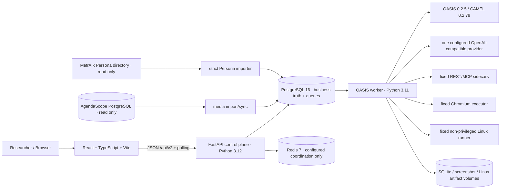
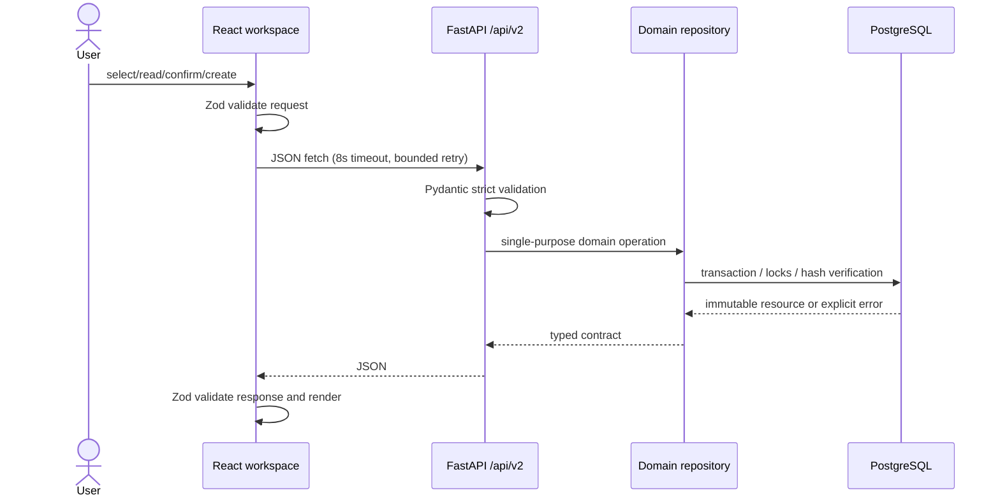
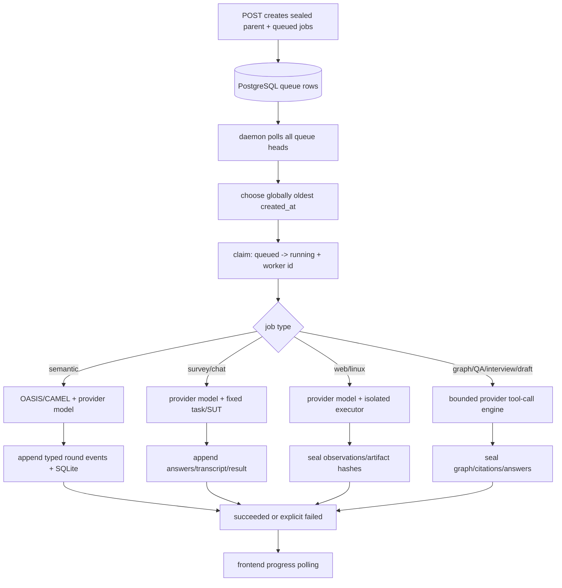
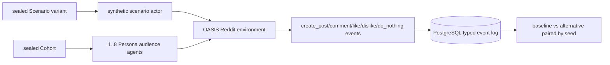
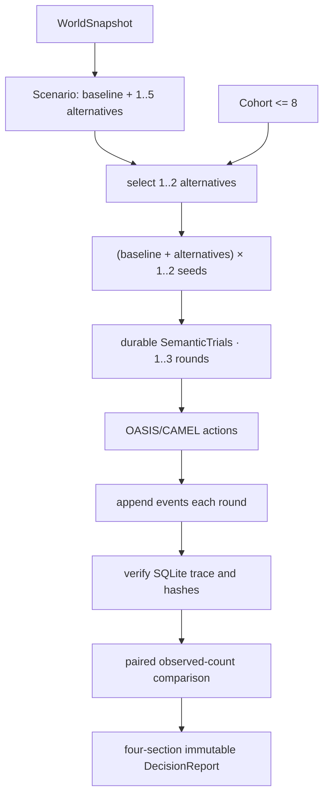

# SandOwl Codebase Discovery Report

> 审计日期：2026-08-16（Asia/Shanghai）  
> 主仓库：`/Users/ssyb/Workspace/web/SandOwl`  
> 上游只读仓库：`/Users/ssyb/Workspace/web/matraix`、`/Users/ssyb/Workspace/web/MiroFish`、`/Users/ssyb/Workspace/web/agendascope`  
> 主仓库基准：分支 `main`，HEAD `152b932`，工作树含未提交开发  
> 审计方式：README/docs、源码、配置、迁移、测试目录、Git 状态与历史的静态只读检查；未启动服务、未运行测试、未访问外部服务  
> 标记约定：未经源码或文档直接确认的判断均以 **[Inference]** 标记。

## 0. Executive Summary

当前主项目已统一使用 **SandOwl**：Compose project、数据卷、应用 UI、文档、package 和 FastAPI 服务身份均使用 `sandowl` / SandOwl。GitHub 远端名称暂时保留旧值，等待单独迁移。

项目不是把三个上游目录简单合并进一个 monorepo。它是从“原 SandOwl”演进而来的、针对证据驱动决策实验重新实现的一套独立产品架构：AgendaScope 提供现实媒体数据；MatrAIx 提供 Persona/Cohort 与人口评测任务语义；MiroFish 提供社会模拟、关系图、报告 Agent 和访谈的设计来源；实际模拟 runtime 使用公共依赖 OASIS/CAMEL，而不是嵌入 MiroFish 仓库。SandOwl 新建了严格 Pydantic/Zod 契约、PostgreSQL schema、内容寻址、不可变封存、持久任务队列、Python 3.11 worker、统一 React 前端与独立 Compose 拓扑。

当前主链已经在代码层接通：

```text
AgendaScope media/policy evidence
  -> human-confirmed immutable WorldSnapshot
  -> baseline/alternative Scenario
  -> MatrAIx Persona Dataset/Cohort
  -> OASIS platform smoke or bounded semantic experiment
  -> typed events / paired observed counts
  -> immutable Decision Report / evidence QA / Persona interview
```

但“代码存在”不等于“当前环境已端到端验收”。`docs/handoff.md` 记录的 2026-08-16 运行快照仍停在数据库迁移 `20260815_core_0032`，没有 Cohort、World、Scenario、实验或报告，且 LLM 配置为空；当前代码工作树已推进到未提交的 `20260816_core_0040` ReportAgent cited-draft 切片。完整自主 ReAct Agent、自动规划、长期记忆、通用 Harbor executor、通用 MCP/Web/Computer Use、认证/RBAC、分布式扩展和生产可观测性均未完成。

**本报告对项目本质的判断：E. 已经基本脱离上游项目、正在形成独立统一架构的新产品工作台。** 它仍选择性移植上游语义与固定样例，但业务主键、数据库、API、队列、前端和运行拓扑已由 SandOwl 自己定义。

---

## 1. 项目是什么

### 1.1 名称与身份

| 层面 | 当前真实名称 | 证据 |
|---|---|---|
| Git 仓库/远端 | SandOwl | `origin git@github.com:NightShiftDev007/SandOwl.git` |
| Compose project/卷 | `sandowl` / `sandowl-*` | `compose.yaml` |
| 根 package | `sandowl` | `package.json` |
| 产品标题/UI | SandOwl | `README.md`、`PRODUCT.md`、`frontend/src/AppShell.tsx` |
| 后端服务标题 | SandOwl | `backend/app/main.py:create_app()` |

名称冲突已经解决，**SandOwl** 是代码仓库、新架构和产品文案的统一名称。

### 1.2 核心目标

SandOwl 面向持续跟踪政策、媒体与现实环境的研究员、分析师和决策团队。它不是自动给出“最佳方案”的预测器，而是让用户能回答四个问题：

1. 依据是什么；
2. 哪些内容是人工假设；
3. 实验真实记录了什么；
4. 结果有哪些边界和不确定性。

系统严格区分四类事实：现实证据、人工确认、实验假设、合成输出。模拟结果不能回写成现实事实，也不能自动表述为预测、因果结论、真人研究、benchmark reward 或决策推荐。依据见 `PRODUCT.md`、`docs/architecture.md` 与 `docs/handoff.md`。

### 1.3 为什么整合三方项目

- **AgendaScope** 解决“现实世界发生了什么、媒体如何传播、证据在哪里”。
- **MatrAIx** 解决“用哪些 Persona 组成群体、怎样运行任务和观察差异”。
- **MiroFish/OASIS** 解决“Agent 如何在社会平台环境中互动演化、如何从图与运行结果形成分析”。
- **原 SandOwl**（第四个、不可忽略的来源）提供 World、Scenario、Run、Decision Thread、Decision Report 的领域语义。Git 历史显示 2026-08-12 的 V2 重构从原 ADC 大量删除企业/GTV/旧模拟代码并重建统一 Core。

三个上游单独都不能满足“可追溯现实证据 -> 冻结假设 -> 人群实验 -> 可核验报告”的完整闭环。SandOwl 的价值在于统一资源身份、版本、内容哈希、状态机、API 和 UI，而不是并排展示三个产品。

### 1.4 最终形态与场景

当前形态是一个**开发中的证据驱动决策实验产品/工作台**，同时具有平台化领域契约和 worker runtime。它不是通用 Agent framework，也不是已经达到生产可用的 SaaS。典型场景是：研究员选择媒体/政策证据，封存现实快照，设置多个政策/传播方案，选择 Persona 群体，在 OASIS 或固定 MatrAIx 任务上运行合成试验，再查看可追溯比较、报告、问答和访谈。

---

## 2. 三个上游项目

### 2.1 MatrAIx

**真实仓库**：`/Users/ssyb/Workspace/web/matraix`  
**远端/基准**：`MatrAIx-ai/MatrAIx-Persona-8B`，HEAD `ea16f1839cde597f54b6ff06ecd47abd9779ebd5`，MIT；工作树干净。

MatrAIx 原项目是 persona-driven evaluation infrastructure，目标是以大规模异质 Persona 对 Survey、Chatbot、Web、桌面/移动应用执行可复现评测。其核心不是社会图谱，而是 Persona 数据、抽样、任务规格、Harbor job/trial、执行器、轨迹、verifier、artifact 和群体聚合。

上游核心目录：

- `persona/`：Persona schema、数据集、生成、抽样、验证与 coreset；
- `application/tasks/`：Survey、Chat、Web、OS App 任务；
- `application/playground/`：FastAPI + React Playground；
- `environment/agents/matraix/agents/persona/`：browser/CLI/computer/survey/chat 等 Persona adapter；
- `environment/runtime/harbor/`：Harbor runtime；
- `packages/playground/`：user simulation、model clients、runner；
- `src/matraix/`：任务目录、Persona job 和 application job；
- `apps/viewer/`：Harbor job/trial viewer。

SandOwl 当前复用/重建的能力：

- 从显式只读目录导入 manifest + Persona YAML，形成 `PersonaDataset`、`Persona`、有序 `Cohort`：`backend/app/populations/import_matraix.py`；
- 固定三题 Survey：`backend/app/matraix_surveys/` 与 worker `survey_*`；
- 固定 Acme REST/MCP Chatbot Evaluation：`backend/app/matraix_chat/`、`backend/acme_support_*`、worker `chat_*`；
- 固定 Quotes to Scrape Web Evaluation：`backend/app/matraix_web/`、`backend/web_browser_executor/`、worker `web_*`；
- 固定 note-to-CSV Linux Artifact：`backend/app/matraix_linux/`、`backend/linux_artifact_runner/`、worker `linux_*`；
- Trial Archive 与 Batch Registry：`backend/app/matraix_trial_archive/`、`backend/app/matraix_batch/`；
- Task Gallery、Persona World、Playground 的信息架构和部分视觉语言；
- `frontend/public/earth/day.webp` 是从经审计 MatrAIx 前端资产压缩而来的 NASA Blue Marble 衍生图，来源记录于 `NOTICE`。

被修改的核心点：SandOwl 没有直接使用上游 Harbor 状态和文件模型，而是把输入、Trial、transcript、event、artifact metadata 和 retry lineage 重建为 PostgreSQL 的严格、不可变资源；任务目标全部是 allowlist 固定样例；前端也重写为统一工作区。

明确舍弃/尚未迁移：通用 Harbor job plane、任意任务/网址/MCP、OS App、真实 Computer Use、录屏、通用 trajectory、完整 verifier/reward、remote runner、1M Persona pool 的高级抽样，以及上游两个独立前端。

**在新系统中的职责**：Persona population + bounded evaluation task semantics，不是主 orchestrator，也不是 knowledge graph 或长期记忆。

### 2.2 MiroFish

**真实仓库**：`/Users/ssyb/Workspace/web/MiroFish`  
**远端/基准**：`666ghj/MiroFish`，HEAD `b5b53acc57189a4a42e44a23e149dc655c98fe82`，AGPL-3.0；SandOwl `NOTICE` 说明另有商业双许可，但授权文件不在仓库内。

MiroFish 原项目自称通用群体智能预测引擎：输入种子文档，动态生成 ontology，写入 Zep GraphRAG，创建 Twitter/Reddit OASIS Agents，持续把行为写回图，再由 ReAct `ReportAgent` 使用图检索与 Agent interview 工具生成预测报告。技术栈是 Flask + Vue + Zep Cloud + OASIS/CAMEL，本地 JSON/JSONL/Markdown/SQLite 和文件 IPC。

上游核心目录：

- `backend/app/services/ontology_generator.py`、`graph_builder.py`：ontology 与 Zep 图构建；
- `zep_tools.py`、`zep_graph_memory_updater.py`：GraphRAG 工具与模拟记忆回写；
- `simulation_manager.py`、`simulation_runner.py`、`simulation_ipc.py`：社会模拟生命周期；
- `backend/scripts/run_*_simulation.py`：Twitter/Reddit/双平台 OASIS；
- `backend/app/services/report_agent.py`：ReAct 报告 Agent；
- `frontend/src/`：D3 图、模拟、报告与交互 UI。

SandOwl 当前复用的是**能力模式与交互语义**，不是 MiroFish 源码仓库：

- 社会平台执行由 `camel-oasis==0.2.5`、`camel-ai==0.2.78` 直接提供，封装在 `backend/oasis_worker/`；
- `frontend/src/RunInteractionGraph.tsx` 借用 MiroFish 关系图交互方式，但只投影真实 Trial events；
- `backend/app/world_graphs/` 和 worker `world_graph_*` 重建了 evidence-backed graph、切片、搜索、时间线和 Persona 匹配；
- `backend/app/report_questions/`、`persona_interviews/` 实现证据受限的问答和合成 Persona 访谈；
- 未提交的 `backend/app/report_agents/`、migration 0039/0040、worker `report_agent_draft_*` 正在实现 bounded ReportAgent 的证据工具和逐字引用草稿。

修改/替换：Zep Cloud 不再是业务必选依赖；PostgreSQL 是图、引用、队列和审计事实源；开放式预测改成有界 synthetic observations；文件 IPC/本地 TaskManager 被 PostgreSQL 队列与 worker heartbeat 替代；Twitter/Reddit 双平台只保留 Reddit platform smoke 与有界语义动作子集。

明确舍弃/尚未迁移：完整自主 ReAct 循环、自动 planner、开放式 tools、Zep insight/panorama/quick-search 的同等实现、长期 Agent memory、运行中 Agent IPC、双平台持久 Agent state 和对活跃 Agent 的真实 interview。

**在新系统中的职责**：提供 social-simulation/graph/report-agent 的设计来源；真实 runtime 由 OASIS/CAMEL 和 SandOwl worker 承担。

MiroFish 上游工作树本身有未提交修改：`backend/app/api/simulation.py`、`services/simulation_runner.py`、`scripts/run_twitter_simulation.py`，以及两个 pnpm lockfile。变更集中在 `no_wait`、磁盘进度、heartbeat、日志编码、并发 30->8 和 300 秒 round timeout，可能是外部编排稳定性试验；不能覆盖。

### 2.3 AgendaScope

**真实仓库**：`/Users/ssyb/Workspace/web/agendascope`  
**代码中的真实名称**：已提交基线叫 `AgendaScope 观澜 · 全球议程设置监控平台`；未提交修改又部分改名为 `Kestrel View 隼观`。不得擅自统一。  
**远端/基准**：`yangyh-2025/agendascope`，HEAD `396a7ed852a781d0698d3e8eea36a63d4a8faa56`，CC BY-NC 4.0；SandOwl `NOTICE` 声明另有商业授权，授权文件不在仓库内。

AgendaScope 是全球媒体监测和议程设置溯源系统，不是 Agent 项目。它以 RSS/GDELT/网页采集为输入，经语言识别、embedding、聚类、LLM 命名、跨日议题维护、首发/跟随链判断、快照和告警，形成来源、文章、议题、传播事件、实体关系与开放数据 API。技术栈为 FastAPI + React、PostgreSQL/pgvector、Redis Streams、可选 Elasticsearch、OpenAI-compatible LLM。

上游核心目录：

- `backend/app/collector/`：RSS/GDELT/网页采集；
- `backend/app/nlp/`、`clustering/`：语言、embedding、聚类；
- `backend/app/agenda_engine/`：topic、origin、followers、revision、snapshot；
- `backend/app/worker/`：固定数据流水线 worker；
- `backend/app/models/` 与 `backend/alembic/`：L0-L3 数据模型；
- `frontend/src/`：地图、热点、事件、来源、实体、告警和开发者 API UI；
- `local_workers/`、`deploy/`：分布式 worker/云端部署草案。

SandOwl 当前复用的是**只读数据模型和媒体语义**：

- `backend/app/media/import_agendascope.py` 明确校验源数据库名、Alembic revision、源/目标不同，使用 `REPEATABLE READ READ ONLY` 扫描；
- 来源、文章、议题、关联、快照、传播 follower 和正向首发观察被幂等投影到 SandOwl `media_*`；
- `backend/app/media/sync_worker.py` 提供默认关闭的周期全量刷新；
- `backend/app/media/repository.py` 和 `/api/v2/media/*` 提供统一只读 API；
- WorldSnapshot 从这些文章复制并封存原文、来源、时间、地域和 SHA-256，不再跟随源库变化。

修改/替换：不是共享数据库 schema，也不是直接调用 AgendaScope 前端/API；SandOwl 自建表并只读导入。删除传播只覆盖“源端消失文章隐藏”，不会删除冻结证据；其他源对象删除不传播。导入是全表扫描 + changed-row upsert，不是真 CDC。

明确舍弃：AgendaScope 账号、开放 API key/RBAC、原前端、采集与 worker 执行、Redis Streams、pgvector/ES、告警、旧 JSONB processing，以及对源库的任何写入。

**在新系统中的职责**：现实媒体 evidence provider，不是 orchestrator、Agent runtime、simulation 或 memory。

AgendaScope 上游工作树约 28 个 tracked 修改并有 `deploy/nginx.local.conf` 未跟踪，涉及品牌、base path、部署、setup 和 alerting。其 v4 新 `article_processing`/`worker_tasks` 目前只是 schema，生产 worker 仍主要使用旧 JSONB；不能把 v4 文档愿景误写成已运行架构。

---

## 3. 代码来源与迁移方式

SandOwl 没有 git submodule、vendor/upstream 代码目录或三个项目的嵌套仓库；只有 `third_party/licenses/MatrAIx-LICENSE` 和 `NOTICE`。对四个仓库的可读源码文件做 SHA-256 同内容扫描后，除通用的 `frontend/tsconfig.json` 与 AgendaScope 相同外，没有发现 SandOwl 与三上游字节级完全相同的源码文件。这不能证明没有改写式移植，但与 `NOTICE` 的“new unified implementation informed by”描述一致。

| SandOwl 模块/目录 | 来源分类 | 修改程度 | 当前用途 |
|---|---|---|---|
| `backend/app/media/` | 基于 AgendaScope 数据契约全新实现 | 高 | 只读导入、媒体副本、查询与同步状态 |
| `backend/app/populations/` | 基于 MatrAIx Persona/Cohort 重建 | 高 | 严格导入、内容寻址 Dataset/Persona/Cohort |
| `backend/app/matraix_*` | 基于 MatrAIx 固定 source samples 重建 | 高 | Survey/Chat/Web/Linux、Archive、Registry |
| `backend/acme_support_*` | MatrAIx source sample 的本地固定 connector | 高 | REST/MCP 确定性 SUT sidecar |
| `backend/web_browser_executor/` | MatrAIx Web sample 的受限执行器 | 高 | 固定三页 DOM/截图 |
| `backend/linux_artifact_runner/` | MatrAIx Linux sample 的受限执行器 | 高 | 固定 note-to-CSV artifacts |
| `backend/oasis_worker/` | 新实现 + OASIS/CAMEL 第三方依赖 | 高 | 所有长任务队列、LLM 与 OASIS 执行 |
| `backend/app/world_models/`、`scenarios/` | 原 SandOwl 语义 + V2 重写 | 高 | 不可变现实与实验假设 |
| `decision_threads/`、`decision_reports/` | 原 ADC 方向 + V2 新实现 | 高 | 持久上下文、封存 findings |
| `world_graphs/` | MiroFish 图/RAG 思路 + V2 新实现 | 高 | PostgreSQL evidence graph/semantic graph |
| `report_questions/`、`persona_interviews/` | MiroFish 交互模式 + V2 新实现 | 高 | 证据问答、合成访谈 |
| `report_agents/`（未提交） | MiroFish ReportAgent 的受控重设计 | 高 | 有界证据 tools 与 cited drafts |
| `frontend/src/MediaGlobe.tsx` | MatrAIx 渲染语言启发 | 高 | 真实地域媒体地球 |
| `frontend/src/RunInteractionGraph.tsx` | MiroFish 图交互启发 | 高 | Trial event graph |
| `frontend/public/earth/day.webp` | MatrAIx 上游内 NASA 资产衍生 | 资源变换 | 地球纹理 |
| React/FastAPI/SQLAlchemy/PostgreSQL 等 | 第三方依赖 | N/A | 平台基础设施 |

Git 历史还表明主仓的 `b4db2dd..eefd9f0` 是原 SandOwl/P1、GTV 和企业扩展时期；`3699223` 在 2026-08-12 大规模删除旧 `decision/engine/ontology/progress/world`、Company/GTV 等代码并建立 Core V2。因此“新项目基于哪个上游”最准确的答案是：**以原 SandOwl 仓库历史为宿主，但当前运行架构是独立重写，三方能力以数据导入、固定 connector、公共 runtime 依赖和交互模式进入。**

---

## 4. 有意义的目录结构

```text
SandOwl/
├── README.md / PRODUCT.md          # 当前能力、产品原则与边界
├── NOTICE                          # 上游基准、许可证与迁移范围
├── docs/
│   ├── architecture.md             # V2 架构与领域边界
│   ├── handoff.md                  # 运行快照、完成度、接手规则
│   └── design.md                   # 视觉规范
├── package.json                    # 顶层 setup/dev/verify/stack/import 命令
├── compose.yaml                    # 单一 SandOwl 运行拓扑
├── .env.example                    # 非秘密开发配置模板
├── scripts/
│   └── test-backend-postgresql.sh  # 隔离真实 PostgreSQL 测试入口
├── frontend/
│   ├── src/
│   │   ├── App.tsx / domain.ts     # hash router 与一级工作区
│   │   ├── *Page.tsx               # Overview/Media/Policy/World/Scenario/Persona/Task/Run/Report
│   │   ├── *Contracts.ts           # Zod wire contracts 与 API functions
│   │   ├── use*.ts                 # 请求、轮询、progress hooks
│   │   └── *.test.ts               # contract/routing/pure-function tests
│   ├── public/earth/day.webp       # 地球纹理
│   └── Dockerfile/nginx.conf       # 生产静态入口与 /api proxy
├── backend/
│   ├── app/
│   │   ├── main.py                 # FastAPI composition root
│   │   ├── config.py / database.py # 运行配置、SQLAlchemy connector/base
│   │   ├── api/                    # /api/v2 route adapters
│   │   ├── media/                  # AgendaScope import/read model
│   │   ├── policy_evidence/        # 人工政策版本证据
│   │   ├── evidence/               # Evidence Bundle projection
│   │   ├── world_models/           # WorldModel/immutable snapshot/evidence graph
│   │   ├── world_graphs/           # semantic graph/search/slice/timeline/persona matching
│   │   ├── scenarios/              # baseline/alternative/intervention
│   │   ├── populations/            # MatrAIx Dataset/Persona/Cohort
│   │   ├── simulations/            # OASIS platform-smoke control plane
│   │   ├── semantic_experiments/   # variant × seed trial matrix/events/comparison
│   │   ├── decision_threads/       # append-only cross-resource context
│   │   ├── decision_reports/       # four-section findings + Markdown
│   │   ├── report_questions/       # evidence-bound QA queue
│   │   ├── report_agents/          # uncommitted bounded evidence tools/drafts
│   │   ├── persona_interviews/     # report-grounded synthetic interviews
│   │   ├── matraix_surveys/        # fixed survey trial
│   │   ├── matraix_chat/           # REST/MCP chat evaluation
│   │   ├── matraix_web/            # fixed browser evaluation
│   │   ├── matraix_linux/          # fixed Linux artifact trial
│   │   ├── matraix_trial_archive/  # unified bounded trial directory
│   │   ├── matraix_batch/          # immutable parent registry/native launch
│   │   ├── shared/                 # strict pagination/progress contracts
│   │   └── system/                 # health/readiness/capability catalog
│   ├── oasis_worker/
│   │   ├── src/oasis_worker/
│   │   │   ├── daemon.py           # oldest-first multi-queue dispatcher
│   │   │   ├── engine.py/queue.py  # OASIS smoke engine and DB queue
│   │   │   └── *_engine.py, *_queue.py, *_contracts.py, *_hashing.py
│   │   └── tests/                  # worker contract/integration tests
│   ├── acme_support_sample/        # fixed REST SUT
│   ├── acme_support_mcp_sample/    # fixed streamable-HTTP MCP SUT
│   ├── web_browser_executor/       # fixed Chromium executor
│   ├── linux_artifact_runner/      # isolated allowlisted artifact writer
│   ├── migrations/versions/        # 0001..0040 Core Alembic chain
│   └── tests/                      # API/domain/PostgreSQL tests
└── third_party/licenses/           # bundled MatrAIx license
```

没有独立 `agent_runtime/`、`memory/`、`prompts/` 或 `workflow/graph` 框架目录；对应能力分别存在于领域包和 worker engine 内。不要仅根据期望目录名推断缺失或重复实现。

---

## 5. 当前整体架构



### 5.1 能力清单

| 问题 | 当前真实状态 |
|---|---|
| 系统入口 | 前端 `frontend/src/main.tsx -> App.tsx`；后端 `backend/app/main.py`；worker `python -m oasis_worker daemon` |
| Frontend/backend/API | 均存在并已统一为单产品；JSON API 为 `/api/v2` |
| Agent runtime | 没有通用 Agent 基类/runtime；各 worker engine 是固定任务执行器 |
| Agent 创建 | Semantic Trial 从 sealed Cohort 投影 OASIS audience agents；其他任务按 Persona 逐 trial 创建模型上下文 |
| 多 Agent 协调 | OASIS agents 通过共享 Reddit 环境间接互动；没有 team/supervisor/Agent-to-Agent IPC |
| Orchestrator | `oasis_worker.daemon._claim_next_job()` 是持久队列 dispatcher，不是通用 workflow orchestrator |
| Workflow/graph | 跨资源流程由 API + DB foreign key/hash 形成；没有 LangGraph/DAG runtime |
| 动态 Agent | 只能从既有 Cohort 实例化固定任务 Persona；不支持动态注册 role/tool/runtime |
| Planner | 当前未发现通用 planner；ReportAgent outline 由用户冻结，自动规划尚未实现 |
| Executor | OASIS、Survey、Chat、Web、Linux、graph、QA、interview、draft 各有单用途 engine |
| Supervisor | 当前未发现 Agent supervisor；daemon 处理 heartbeat/orphan/failure |
| HITL | 证据阅读确认、policy 人工捕获、Scenario/Cohort/工具调用选择；运行中暂停/审批当前未发现 |
| Memory | 有持久证据、transcript、event、thread revision；没有 Agent 长期/episodic/vector memory |
| Context management | 以 sealed snapshot/cohort/report 和有界 prompt projection 管理；没有通用 context window manager |
| Tool system | bounded ReportAgent 有 3 个固定只读 tools；Chat 仅固定 MCP allowlist；无全局 tool registry |
| MCP | 仅 Acme Support streamable-HTTP MCP 固定 connector；不支持任意用户 MCP |
| Event/message bus | 当前未发现；Redis 部署存在但业务队列实际在 PostgreSQL |
| 任务队列 | PostgreSQL 行级状态 + claim/heartbeat/orphan 处理；单 Compose worker 顺序执行 |
| Simulation engine | OASIS Reddit platform smoke + bounded semantic experiments |
| World/environment | `WorldSnapshot` 是现实证据快照；OASIS Reddit 是执行 environment；没有通用 world simulator |
| Social simulation | 有，限制为 1-8 Persona、1-3 rounds、最多 96 persona-rounds |
| Knowledge graph | 有直接证据图和 LLM evidence-backed semantic graph，均由 PostgreSQL 保存 |
| RAG | 有证据图搜索/QA prompt grounding；当前是精确 substring/结构化读取，不是向量 RAG |
| Database | PostgreSQL 16 主事实源；Redis 仅配置/健康；OASIS 产物为 SQLite；artifact 独立卷 |
| LLM provider | 一个显式 OpenAI-compatible endpoint，由 `LLM_API_KEY/BASE_URL/MODEL_NAME` 配置 |
| Prompt 管理 | schema/version 常量分散在各 worker contract/engine；没有集中 prompt registry |
| Agent/task state | PostgreSQL `queued -> running -> succeeded/failed`；输入多为 draft -> sealed |
| User/session | 无认证/用户表/浏览会话；`DecisionThread` 是业务任务，不是登录 session |
| Streaming | 无 SSE/WebSocket；前端 polling；Chat transcript/event 支持增量游标 |
| Async | FastAPI async DB；worker 内 async model/OASIS 调用，但 daemon 主循环一次只执行一个 job |
| 并行 Agent | 单 semantic trial 内 OASIS 执行多 Persona；矩阵 trials 在单 Compose worker 上顺序领取 |
| Checkpoint/resume | Semantic round events/current round 持久化，但 orphan 变 failed；没有从 checkpoint 原地 resume |
| Retry | Survey/Chat/Web/Linux 可创建最多五次不可变新 attempt；不是通用 resume |
| Tracing/observability | health/readiness、worker heartbeat、typed events、progress/hash、结构化日志；无集中 trace/metrics/APM/SLO |
| Evaluation | 有 paired count、Survey、Chat/Web/Linux typed results；无统一 benchmark/reward/eval framework |
| Self-evolution/learning/reflection | 当前未发现 |

Redis 在 `compose.yaml`、`config.py` 和 readiness 中存在，但业务代码未发现 Redis client 读写；“Redis 只用于短期协调”是设计文档表述，当前实现更接近预留依赖。

---

## 6. 核心运行链路

### 6.1 用户请求链路



前端不是静态 demo：十个一级工作区均指向真实 API，错误和 readiness 会显式显示；但没有登录、多用户或生产权限。

### 6.2 Agent/worker 执行链路



断点：没有通用取消；worker 崩溃后 running job 被 orphan failure，而非原地 resume；单 Compose worker 会串行处理不同任务类型。

### 6.3 多 Agent 协作链路



这不是 supervisor 式多 Agent 团队。协作只发生在共享社交环境中，且公开动作集合固定。

### 6.4 Simulation 链路



平台 smoke 是另一条独立链：只取 Scenario alternative，以 StubModel 和单 synthetic actor 手工 `CREATE_POST`，不读取 Cohort，也不能产生社会预测。

---

## 7. 核心 Abstractions

| 抽象 | 文件/类型 | 职责、创建者、调用关系与生命周期 |
|---|---|---|
| RuntimeSettings | `backend/app/config.py` | 从环境构造 database/redis 配置；`main.py` 启动时创建；应用全生命周期只读 |
| DatabaseConnector/ApplicationBase | `backend/app/database.py` | async SQLAlchemy session 与 ORM base；FastAPI app 持有 connector |
| MediaArticle/Source/Topic | `backend/app/media/models.py` | AgendaScope 的 SandOwl read model；importer 创建/更新，媒体 API 读取；article 可标源端缺失但冻结副本不删除 |
| PolicyDocumentVersion | `policy_evidence/models.py` | 人工捕获的稳定政策版本；repository 创建，WorldSnapshot 复制；sealed 后 DB 防篡改 |
| WorldModel/WorldSnapshot | `world_models/models.py`、`contracts.py` | 世界容器与某一不可变证据版本；用户/API 创建；Scenario/Evidence/Graph 引用；snapshot sealed 后永久只读 |
| EvidenceBundle | `evidence/contracts.py`、`repository.py` | sealed snapshot 的只读投影，不复制第二套事实；ReportAgent/前端读取 |
| Scenario/Variant/Intervention | `scenarios/*` | baseline + alternatives + ordered initial posts；从明确 snapshot 创建，content-addressed/sealed；run 引用 |
| PersonaDataset/Persona/Cohort | `populations/*` | MatrAIx 文件导入和用户选择的人群；importer/API 创建；所有 task/semantic 引用；sealed 后不可变 |
| SimulationRun | `simulations/*` | platform smoke 输入/状态/结果；API 入队，daemon claim，engine 完成；queued->running->terminal |
| SemanticExperiment/Variant/Trial/Event | `semantic_experiments/*` | Scenario×Cohort×seed 矩阵及 append-only 动作；API 展开，worker 执行；comparison 聚合成功配对 |
| DecisionThread/Revision | `decision_threads/*` | 将 Snapshot/Scenario/Cohort/Experiment/Report 组织成可恢复上下文；用户创建并只追加 revision；不是聊天 session |
| DecisionReport/Section | `decision_reports/*` | 固定四章、实际配对计数、来源与限制；从成功 experiment 生成，sealed 后导出 Markdown |
| ReportQuestion | `report_questions/*` | 最多五轮 evidence-bound 追问；API 入队，worker 回答；每轮重新绑定图证据 |
| PersonaInterview/Session | `persona_interviews/*` | Report+Cohort+Persona 的合成视角；单人或 2-8 人原子 session；worker 生成受限引用回答 |
| SemanticWorldGraph | `world_graphs/*` | snapshot 上 evidence-backed entities/edges/citations；worker 抽取；成功后 slice/search/timeline/matching |
| MatrAIx parent/trial | `matraix_surveys/chat/web/linux/*` | 固定任务输入、逐 Persona trial、typed result；API 创建 parent，worker 执行，Archive/Registry 投影 |
| ParentProgress | `shared/progress.py` | 统一 parent attempt/trial/event 状态摘要；前端轮询读取；不包含观测时间以保持稳定 hash |
| Worker heartbeat | `simulations/models.py`、worker `queue.py` | 发布 runtime/model/config readiness；API 决定是否允许入队；过期 heartbeat 使任务不可用 |
| DaemonSettings/daemon | `oasis_worker/daemon.py` | 验证配置、探测 provider/connectors、清理 orphan、顺序分派所有队列；进程生命周期 |
| ReportAgentRun/ToolCall/Draft | `report_agents/*`（未提交） | 单 snapshot、冻结 outline、1-20 次预算、3 个 evidence tools、已读前缀 cited draft；API/worker 创建；DB append-only |

当前没有通用 `Agent`、`Task`、`Message`、`ToolRegistry`、`Workflow`、`Planner`、`Memory` 基类。系统有同名概念，但都是领域特定结构；下一阶段不应先制造一套抽象基类再强迫所有模块迁移。

---

## 8. 前端分析

前端是 React 18 + TypeScript + Vite，使用 Zod 做所有重要响应的 runtime validation；图形库包括 ECharts、Three.js、TopoJSON/world-atlas。没有 Redux/Zustand；状态主要是页面本地 React state + 自定义 `use*` hooks。路由不是 React Router，而是 `App.tsx` 中严格解析的 hash router。

一级工作区以 `frontend/src/domain.ts` 为准：

| Hash route | 页面 | 当前职责 |
|---|---|---|
| `#/overview` | `OverviewPage` | 媒体态势、真实地域地球、传播和能力入口 |
| `#/threads` | `DecisionThreadsPage` | 持久决策任务与资源 revision |
| `#/media` | `MediaPage` | 文章、议题、时间线、来源档案 |
| `#/policy` | `PolicyEvidencePage` | 人工政策版本证据 |
| `#/world` | `WorldModelPage` | 证据确认、snapshot、直接图/语义图/Evidence Bundle/ReportAgent 面板 |
| `#/decisions` | `ScenarioPage` | baseline/alternative/intervention |
| `#/personas` | `PersonaWorldPage` | Dataset/Persona/Cohort |
| `#/tasks` | `TaskGalleryPage` | capability-driven Survey/Chat/Web/Linux/Archive/Registry |
| `#/runs` | `OasisPlatformSmokePage` | platform smoke 与 semantic Playground |
| `#/reports` | `DecisionReportsPage` | findings、Markdown、QA、Persona interview |

API 层由 `frontend/src/apiClient.ts` 统一处理：GET 最多两次尝试、8 秒 timeout、400ms delay；POST 对结果不明保持谨慎；错误分为 HTTP/network/payload/timeout。每个业务 contract 文件通过 Zod 拒绝后端 schema 漂移。

实时性采用 polling：通常 2-5 秒；Chat 通过全局单调 message cursor 增量合并 transcript；semantic events 按 sequence 增量读取。没有 WebSocket/EventSource/SSE。Graph UI 包括真实媒体地球、证据世界图、语义世界图、Trial 互动图；不存在可编辑 workflow canvas。

完成度判断：前端已经是正式系统入口，不是单页 demo；但多个页面文件很大（例如 `WorldModelPage.tsx`），没有端到端浏览器测试、认证 UI、协作 UI 或生产审计 UI。Task Gallery 会把未迁移 OS App/Harbor 明确锁定，不用假成功数据伪装。

---

## 9. 后端、API 与 Worker

后端是 Python 3.12 FastAPI + Pydantic 2 + SQLAlchemy async + asyncpg；没有独立 service-layer class hierarchy，常见结构是 `api -> repository -> ORM/contract/hash`。这是简洁的领域包架构。`backend/app/main.py:create_app()` 是 composition root。

worker 因 OASIS 0.2.5 要求 Python `<3.12`，独立使用 Python 3.11、psycopg、CAMEL/OASIS、MCP。`daemon.py` 在启动时真实探测 provider 和固定 connectors，然后在 PostgreSQL 中比较所有 queue head，按 `created_at/kind/id` 领取最旧任务。一个 Compose worker 串行执行；heartbeat 线程独立运行。

### 9.1 主要 API

| Method | Path/group | Handler/module | Purpose |
|---|---|---|---|
| GET | `/health`, `/readyz`, `/api/v2/system/*` | `api/system.py` | liveness、DB readiness、capability catalog |
| GET | `/api/v2/media/overview|articles|topics|sources|propagation|sync-status` | `api/media.py` | AgendaScope 媒体只读查询 |
| POST/GET | `/api/v2/policy-documents...` | `api/policy_evidence.py` | 捕获文档/版本、读取完整正文 |
| POST/GET | `/api/v2/world-models...` | `api/world_models.py` | 创建 model/snapshot，读取证据图与冻结正文 |
| POST/GET | `/api/v2/world-models/.../semantic-graphs` | `api/world_graphs.py` | 入队/列出 semantic graph |
| GET/POST | `/api/v2/world-graphs/{id}/slice|search|evidence-timeline|edges/...|nodes/...` | `api/world_graphs.py` | 图查询、历史、Persona 匹配/建 Cohort |
| POST/GET | `/api/v2/scenarios` | `api/scenarios.py` | 创建/列出/读取 Scenario |
| GET/POST | `/api/v2/populations/datasets|cohorts...` | `api/populations.py` | 读取 Persona、创建 Cohort |
| POST/GET | `/api/v2/simulation-runs/platform-smoke...` | `api/simulation_runs.py` | OASIS platform smoke |
| POST/GET | `/api/v2/semantic-experiments...` | `api/semantic_experiments.py` | 创建矩阵、状态、comparison、trial events/readiness |
| POST/GET | `/api/v2/decision-threads...` | `api/decision_threads.py` | thread 与只追加 revisions |
| POST/GET | `/api/v2/decision-reports...` | `api/decision_reports.py` | 从 experiment 生成报告、Markdown |
| POST/GET | `/api/v2/decision-reports/{id}/questions...` | `api/report_questions.py` | 报告问答与 context |
| POST/GET | `/api/v2/decision-reports/{id}/persona-interviews...` | `api/persona_interviews.py` | 单/多人合成访谈 |
| GET | `/api/v2/evidence-bundles...` | `api/evidence_bundles.py` | snapshot evidence projection/content |
| POST/GET | `/api/v2/report-agent/runs|drafts|tools...` | `api/report_agents.py`（未提交） | bounded evidence tools/cited draft |
| POST/GET | `/api/v2/matraix/survey-*` | `api/matraix_surveys.py` | Survey parent/trial/retry/progress/readiness |
| POST/GET | `/api/v2/matraix/chat-*` | `api/matraix_chat.py` | Chat parent/trial/transcript delta/trajectory/retry |
| POST/GET | `/api/v2/matraix/web-*` | `api/matraix_web.py` | Web trial/screenshot/retry/progress/readiness |
| POST/GET | `/api/v2/matraix/linux-*` | `api/matraix_linux.py` | Linux trial/evaluation/artifact/retry/readiness |
| GET | `/api/v2/matraix/trials...` | `api/matraix_trial_archive.py` | unified bounded archive + integrity verification |
| POST/GET | `/api/v2/matraix/batch-*` | `api/matraix_batch.py` | immutable registry/native Survey/Chat launch |

### 9.2 进程与外部集成

- `backend`：控制面，不直接运行长 LLM/OASIS 任务；
- `oasis-worker`：执行 10 类队列任务；
- `media-sync-worker`：默认关闭的 AgendaScope 全量快照刷新；
- `acme-support-sample` / `acme-support-mcp-sample`：固定 SUT；
- `matraix-web-browser`：无 Docker socket 的固定 Chromium；
- `matraix-linux-runner`：internal network、非特权、固定 artifact；
- `migrate`：服务启动前 Alembic upgrade；
- `frontend`：Nginx 静态文件/API reverse proxy；
- `postgres`、`redis`：数据与预留协调依赖。

没有 scheduler（除 media fixed-delay worker）、Celery、Kafka、RabbitMQ 或通用 background task framework。

---

## 10. 数据模型与状态生命周期

PostgreSQL ORM 按领域分包。重要表族包括：

- `media_sources/articles/topics/topic_articles/topic_snapshots/first_utterances/propagation_*`；
- `policy_sources/documents/document_versions`；
- `world_models/world_snapshots/world_snapshot_evidence/world_snapshot_policy_evidence`；
- `scenarios/scenario_variants/scenario_interventions`；
- `persona_datasets/personas/cohorts/cohort_members`；
- `simulation_runs`、worker heartbeat；
- `semantic_experiments/variants/trials/events`；
- `semantic_world_graphs/nodes/edges/evidence/cohort_origins`；
- `decision_threads/revisions`、`decision_reports/sections`；
- `report_questions`、`persona_interviews/sessions/members`；
- `matraix_survey_*`、`matraix_chat_*`、`matraix_web_*`、`matraix_linux_*`；
- `matraix_batch_registries/items`；
- 未提交的 `report_agent_evidence_runs/tool_calls/cited_drafts`。

### 10.1 静态资源生命周期

```text
external/validated input
  -> transaction creates draft parent + ordered children
  -> canonical serialization + SHA-256
  -> seal timestamp
  -> DB triggers reject update/delete/append/TRUNCATE
  -> downstream resources bind exact ID + digest
```

WorldSnapshot、Scenario、Dataset、Cohort、Report、Batch Registry 等都遵循内容寻址/封存原则。WorldSnapshot 创建时重新计算用户已读文章的 evidence revision；源文章发生变化会返回 409，要求重新确认。

### 10.2 运行资源生命周期

常见状态为：

```text
queued -> running -> succeeded
                  \-> failed
```

数据库 trigger 限制唯一合法 transition，并要求 terminal 字段与状态一致。worker heartbeat 过期后 orphaned running job 被标 failed；不会自动恢复到 queued。Survey/Chat/Web/Linux 的 retry 新建 immutable attempt 并保留父失败记录，最多五次。

### 10.3 Agent/session/user state

- Agent state：Persona profile、trial input、round events、transcript 和 result，按具体任务存储；
- Session state：Persona interview session/DecisionThread 是业务资源；无通用 Agent session；
- User state：当前未发现 user/account/auth schema；
- Memory：长期保留业务事实和运行记录，但没有可写的 Agent memory store；
- 删除：sealed 资源大多禁止删除；artifact retention policy 尚未建立；
- 恢复：可通过 IDs/hash/DecisionThread 深链重新读取上下文，但不是执行 checkpoint resume。

---

## 11. 真正的融合点

三方连接不是发生在一个“总 orchestrator.py”，而是沿统一资源契约在几个 seam 上完成。

### Seam A：AgendaScope -> Evidence -> World

```text
AgendaScope tables
 -> backend/app/media/import_agendascope.py
 -> SandOwl media_* tables
 -> backend/app/world_models/repository.py
 -> immutable WorldSnapshot/EvidenceBundle
```

这是数据复制和语义冻结，不是 API wrapper 或共享数据库。它把外部可变媒体事实变成可追溯、不可变的实验输入。

### Seam B：MatrAIx Persona -> Cohort -> OASIS

```text
MatrAIx manifest/YAML
 -> backend/app/populations/import_matraix.py
 -> PersonaDataset/Persona/Cohort
 -> backend/app/semantic_experiments/repository.py
 -> backend/oasis_worker/semantic_queue.py
 -> semantic_engine.py + OASIS/CAMEL
```

控制面把 sealed Scenario、sealed Cohort、variant 和 seeds 展开为 trial matrix；worker 将 Persona 规范化为有界 prompt profile并运行 OASIS。这是 MatrAIx population 与 MiroFish/OASIS simulation 真正发生连接的地方。

### Seam C：MatrAIx fixed tasks -> unified durable trials

```text
Cohort
 -> matraix_surveys/chat/web/linux repositories
 -> PostgreSQL trial queues
 -> worker engines + fixed sidecars/executors
 -> Trial Archive / Batch Registry / frontend Task Gallery
```

这不是完整 Harbor migration，而是四条安全纵向切片。

### Seam D：Simulation -> Graph/Report/MiroFish interaction patterns

```text
typed SemanticTrial events
 -> frontend RunInteractionGraph
 -> paired comparison
 -> DecisionReport
 -> report QA / Persona interview
```

另一条图链从 WorldSnapshot 正文进入 semantic graph，再被 report QA 引用。未提交 ReportAgent 切片又把 EvidenceBundle 的媒体/政策正文作为 allowlisted tools，冻结已读证据前缀并生成逐字 citation draft。

### 融合程度结论

当前不是“仅放进一个仓库”，也不是“三套 runtime 通过 adapter 并存”。AgendaScope 和 MatrAIx 上游 runtime 都没有直接运行；SandOwl 只读导入数据/Persona，并统一改写。MiroFish 本身也不运行；公共 OASIS/CAMEL 依赖进入独立 worker。融合已经发生在统一 DB/API/资源生命周期层，但更高层的通用 Agent planner、长期 memory 和 Harbor execution plane 仍未融合。

---

## 12. 当前开发进度

### 已完成（代码层）

- 独立 React/FastAPI/PostgreSQL/OASIS-worker/Compose 基础设施；
- AgendaScope 来源、文章、议题、传播、首发观察的只读导入和 API/UI；
- 人工政策证据、不可变版本和 WorldSnapshot 精确绑定；
- WorldModel/Snapshot、Evidence Bundle、Scenario、Cohort；
- OASIS platform smoke 和有界 semantic experiment；
- PostgreSQL 直接证据图、LLM semantic graph、slice/search/timeline/history/Persona matching；
- DecisionThread、固定四章 DecisionReport、Markdown；
- report QA、单/多人 Persona interview；
- MatrAIx Survey、固定 REST/MCP Chat、固定 Web、固定 Linux；
- Trial Archive、Batch Registry、retry lineage、progress、Chat transcript delta；
- capability/readiness、worker heartbeat、真实 provider/connectors startup probes；
- 未提交切片中 bounded ReportAgent evidence tools 与 cited draft 已贯穿 migration/model/API/worker/UI/tests。

### 基本完成但需真实验收

- LLM semantic/Survey/Chat/Web/Linux/graph/QA/interview/draft 路径：代码完整，但文档运行快照中 LLM 未配置；
- 媒体周期刷新：有成功运行记录，但仍是全扫描而非 CDC；
- artifact 与 retry：固定任务可用，缺少统一 retention/cancel/export governance；
- 前端：正式入口已形成，但缺 e2e、auth、协作和可访问性系统验收。

### 正在实现

- bounded ReportAgent：0039/0040、API/worker/UI/test 均在当前未提交工作树；自动规划仍没有；
- 工作树中还更新了 PostgreSQL tests、system capability 和文档，表明该切片正在集成验证阶段。

### 尚未实现

- 自动受控 planner、完整自主 ReAct、开放式工具循环；
- 长期 Agent memory、运行中 Agent IPC、双平台状态；
- 通用 Harbor job/verifier/trajectory/artifact/remote worker；
- 通用 Web、任意 MCP、Computer Use/OS App；
- 真 CDC、政策自动摄取/效力层级；
- graph 混合向量检索、事实有效期、规模基准/GDB provider；
- auth/RBAC/team/audit、secret manager、backup/HA、quota/rate/cost、retention、SLO/alert；
- self-evolution/learning/reflection。

### 明确非目标/已抛弃

- Company 主体、企业别名、企业 coverage、产业链、股权链、GTV；
- 把模拟结果冒充现实事实或自动“最佳方案”；
- Zep Cloud 作为业务主键或必选图后端；
- 复制三个上游产品的独立菜单和前端。

### 已知 bug/风险

本次没有运行系统，不能声明 runtime bug 已复现。静态可确认的状态风险见第 16 节。SandOwl 源码中没有显著 TODO/FIXME；缺口主要由文档和 capability 显式描述，而不是注释。

---

## 13. Git 状态与发展时间线

### 13.1 SandOwl 当前状态

```text
branch: main
tracking: origin/main
ahead: 5, behind: 0
HEAD: 152b932 (2026-08-16)
tracked modified: 20 files
untracked: 18 files
staged: 0
```

五个本地已提交但未推送的 commits：

1. `75929b9` integrate evidence and MatrAIx workflows；
2. `907e74e` retry lineage and lightweight progress；
3. `5ff26ab` paginate MatrAIx run directories；
4. `84239b1` Linux evaluation directory；
5. `152b932` bind policy evidence to world snapshots。

当前未提交工作主要是 ReportAgent 0039/0040：`backend/app/report_agents/`、API、worker draft engine/queue/contracts/hashing、migration、前端 evidence panel/contracts，以及相应 PostgreSQL/worker/frontend tests。不要 reset、checkout 或覆盖这些文件。

### 13.2 主仓时间线解释

- **2026-07-10 至 07-21**：原 SandOwl P1、品牌化、simulation/report、ontology、GTV 和企业能力快速扩展；
- **2026-08-12 `3699223`**：架构转折点。建立 unified V2 Core，大量删除旧 monolithic simulation/ontology/GTV/company 代码，重建严格领域包、独立迁移与 OASIS worker；
- **2026-08-13 `76a7cfa`**：扩大核心整合，加入 Persona/semantic graph/report/question/survey 等大批纵向切片；
- **2026-08-16 五个本地 commits**：集中补 fixed MatrAIx tasks、archive/registry、retry/progress、policy evidence；
- **当前未提交**：bounded ReportAgent 从只读 evidence tools 推进到 cited draft。

这说明团队当前不是做 UI 拼接，而是在高频地建立“内容寻址 + 不可变数据库 + 固定可验收纵向切片”。

### 13.3 上游 Git 状态

| Repo | Branch/HEAD | Worktree | 最近重点 |
|---|---|---|---|
| MatrAIx | `main` / `ea16f18` | clean | Persona 1M sampling、Playground API-only catalog、Harbor cohort/job/report |
| MiroFish | `main` / `b5b53ac` | 3 modified + 2 untracked | committed history聚焦 Zep/ontology/报告可靠性；本地改动聚焦 no-wait/heartbeat/并发 |
| AgendaScope | `main` / `396a7ed` | 约28 modified + 1 untracked | committed v4 L0-L3/分布式设计；本地改名、base path、部署/setup |

上游 dirty worktrees 不是 SandOwl 的未提交文件，但属于“整个工作区”的重要状态；任何后续同步都必须先区分上游用户修改与公开基准。

---

## 14. 如何运行

以下命令来自真实配置，未在本次审计中执行。

### 14.1 本地开发

要求 Node >=18、pnpm 9.15、uv、Python 3.12（API）与 3.11（worker）。

```bash
cd /Users/ssyb/Workspace/web/SandOwl
pnpm install
pnpm setup
pnpm dev
```

- Vite：`http://127.0.0.1:3300`
- FastAPI：`http://127.0.0.1:8310`
- OpenAPI：`http://127.0.0.1:8310/api/v2/docs`

`pnpm setup` 分别执行 backend Python 3.12、oasis worker Python 3.11 和 frontend frozen lockfile 安装。

### 14.2 完整 Compose

```bash
pnpm stack
```

- frontend：`127.0.0.1:3200`
- backend：`127.0.0.1:8210`
- Compose 先 migrate，再启动各服务。

非本机必须换独立环境文件和凭据：

```bash
SANDOWL_ENV_FILE=/absolute/path/to/sandowl.env pnpm stack
```

### 14.3 必需/可选环境变量

基础：`APP_ENV`、`DATABASE_URL`、PostgreSQL user/password/db、`REDIS_URL/PASSWORD`、bind ports。  
AgendaScope import：`AGENDASCOPE_DATABASE_URL`、`AGENDASCOPE_EXPECTED_DATABASE_NAME`、`AGENDASCOPE_EXPECTED_SCHEMA_REVISION`。  
LLM：`LLM_API_KEY`、`LLM_BASE_URL`、`LLM_MODEL_NAME` 必须全空或全填；部分填写会令 worker 启动失败。  
worker 内部：Compose 提供固定 SUT/browser/Linux URLs。

### 14.4 导入

```bash
SANDOWL_ENV_FILE="$PWD/.env.media-sync" pnpm import:agendascope
SANDOWL_ENV_FILE="$PWD/.env.media-sync" pnpm stack:media-sync

MATRAIX_PERSONA_DATASET_PATH='/absolute/path/to/persona/dataset' \
  pnpm import:matraix-personas
```

### 14.5 迁移、测试、lint、build

```bash
pnpm migrate
pnpm migrate:check
pnpm test:backend
pnpm test:backend:postgres
pnpm lint:backend
pnpm test:oasis-worker
pnpm lint:oasis-worker
pnpm test:frontend
pnpm typecheck:frontend
pnpm build:frontend
pnpm verify
```

`pnpm verify` 是全量入口；日常应按改动范围选择。`test:backend:postgres` 使用 Compose `test` profile、tmpfs 和不暴露端口的独立数据库。

### 14.6 当前能否正常运行

静态配置完整，`docs/handoff.md` 记录 2026-08-16 时 backend/DB/OASIS platform smoke 在线；但该快照数据库仅到 `0032`，当前代码 head 为未提交 `0040`，LLM 配置为空且没有完整演示资源。本次未重新启动或测试，因此只能说**基础栈曾被核验可用，当前工作树的完整 0040 状态未在本报告中实测**。

---

## 15. 测试覆盖

静态统计：

| 层 | 文件/用例近似量 | 覆盖重点 |
|---|---:|---|
| backend | 62 test files / 255 test functions | contracts、repositories、API、hash、migrations、PostgreSQL triggers、media import |
| oasis worker | 12 files / 70 functions | OASIS smoke、semantic contracts/integration、Survey/Chat/Web/Linux、graph、QA/interview/draft |
| frontend | 34 `.test.ts` / 203 `it/test` | Zod contracts、route parsing、selection/pure transforms |

有较强保障的能力：World/Scenario/Population contracts、content hashing、各 API handler、MatrAIx fixed task contracts、progress/retry、migration chain、真实 PostgreSQL 不可变 trigger、worker output normalization。`backend/oasis_worker/tests/test_oasis_integration.py` 与 semantic integration 覆盖真实本地 OASIS/SQLite；external provider 调用是显式 marker，不应默认付费执行。

明显薄弱：没有浏览器 e2e、没有完整 Compose 纵向业务测试、没有生产迁移/备份恢复测试、没有多 worker/故障注入/容量测试、没有 auth（功能本身不存在）、没有真实 LLM provider 的默认 CI 验收。大量前端测试是 contract/pure function，不等于视觉和交互端到端保障。

本次是分析任务，未运行测试；报告没有把测试文件存在误写为当前通过状态。

---

## 16. 当前技术问题与优先级

### P0

当前未发现会在既定开发环境中必然导致数据损坏或安全事故的已证实 P0。未经运行验证，不凭空制造 P0。

### P1

1. **代码/数据库/演示链未处于同一验收状态。** `docs/handoff.md` 的数据库快照为 0032，工作树代码为 0040；LLM disabled，Cohort/World/Scenario/Run/Report 均为 0。关键能力大多“代码接通但未形成同一套真实 demo”。证据：`docs/handoff.md` §6。
2. **生产安全和治理缺失。** FastAPI 当前没有 auth/user/RBAC/team/audit，artifact 下载/retention、secret manager、quota/rate/cost、backup/HA 也没有。只适合隔离开发环境，不适合公开部署。证据：`backend/app/main.py` 路由、`docs/handoff.md` §9.5。
3. **单 worker 串行执行形成故障域和吞吐瓶颈。** `daemon.py` 的一个 while loop 从十类队列选最老 job 并同步等到完成；Compose 只有一个 worker。长 semantic job 会延迟 QA/graph/Survey 等。虽然 queue claim 可能支持多 worker ID，但水平扩展、配额和公平性未设计/验收。
4. **当前大块未提交工作必须先封存/验收。** 20 tracked modified + 18 untracked、5 commits ahead origin；ReportAgent migration/API/worker/UI 跨层同时未提交。丢失或部分应用会造成文档、migration head 和 runtime contract 不一致。

### P2

1. **品牌/服务身份已统一。** SandOwl 现用于 API、部署和用户沟通；旧名仅保留在不可变协议、迁移历史和暂未迁移的 GitHub 远端中。
2. **Redis 是部署必需但业务使用不清晰。** Compose/backend readiness 强制配置 Redis，源码却未发现业务 client 使用；增加运行复杂度且文档“短期协调”与实现不完全一致。
3. **契约重复导致漂移成本。** backend Pydantic、worker Pydantic、frontend Zod 对 Survey/Chat/Web/Linux/ReportAgent 分别维护，同类 constants/hash schema 多处复制。边界隔离是合理的，但当前没有生成或集中 compatibility test；新增字段需三处同步。
4. **任务模型高度特化且 dispatcher 已膨胀。** `daemon.py` 导入并分支十种 job，每种有独立 queue/engine/hash/contracts。继续追加类型会加重重复 orphan/failure/readiness 逻辑；在真正需要第十一、十二类任务前应讨论最小 job adapter protocol，而不是重写成抽象框架。
5. **轮询代替事件流。** 多个 hooks 2-5 秒 polling，Chat/event 才有增量 cursor。规模扩大后会造成读放大；当前没有 SSE/WebSocket/event bus。
6. **checkpoint/resume 语义不足。** round/event 虽持久，但 worker crash 直接 fail；retry 创建新 attempt。长任务成本上升后需要明确哪些 job 可安全 resume。
7. **Prompt 管理分散。** schema version 是优点，但 prompt 文本散落在各 engine；缺少统一 inventory、diff 和 offline eval，跨任务更改难审计。

### P3

1. 若干 React 页面/worker 文件很大，局部改动 review 成本高；但不应为“整洁”无目标拆分。
2. 没有统一 API pagination 风格的自动 OpenAPI client；当前 hand-written Zod contracts 可读但维护量大。
3. Graph 当前 substring search/有限多跳对小数据足够；向量/混合检索与 GDB 只是规划，不能在产品文案中过度承诺。

### 上游独立风险（不等于 SandOwl bug）

- AgendaScope v4 schema/worker/compose 有明显漂移，SandOwl 正确地只读导入稳定列，不应改为直接依赖其 v4 worker；
- MiroFish 使用单机文件状态、进程内锁和 Zep Cloud，SandOwl 不应回退复制这套持久化；
- MatrAIx 完整 Harbor 很强但依赖与执行面大，不能把四个 fixed samples 宣称为完整迁移。

---

## 17. 已做出的关键架构决策

1. **独立 V2 Core，而非运行三个上游。** 原因在 `docs/architecture.md`：统一领域契约、任务状态、内容摘要、队列、前端和 Compose。
2. **PostgreSQL 是业务事实源。** 外部源、文件 artifact、Redis 都不能成为业务主键；sealed rows 由 trigger 保护。
3. **现实/假设/合成输出分层。** 防止模型输出污染 evidence，是全系统最重要语义决策。
4. **内容寻址和 draft->sealed 优先。** 网络重试、源数据漂移和跨阶段引用都通过 SHA-256 与 exact ID 处理。
5. **API 3.12 / worker 3.11 分离。** 原因明确：OASIS 0.2.5 的 Python 版本约束；仍保持同仓 Compose。
6. **MiroFish 不作为 runtime repo，直接依赖 OASIS/CAMEL。** `NOTICE` 明确没有复制 MiroFish source 到 worker。
7. **Zep Cloud 不再是必选。** 默认 PostgreSQL graph，未来达到明确瓶颈才考虑 GDB/Lindorm provider。
8. **固定 allowlist 纵向切片先于通用执行器。** Chat/Web/Linux 都限制目标、网络、工具和 artifacts，避免提前暴露任意 MCP/browser/shell。
9. **Readiness 与 capability 分离。** 代码存在不等于 runtime ready；真实 provider/connector startup probe 后才开放提交。
10. **前端统一任务工作区。** 不让用户理解三个来源项目；核心导航围绕 evidence->world->decision->run->report。
11. **Policy -> bounded ReportAgent -> Harbor executor 的建设顺序。** 先稳定证据，再受控分析，最后扩执行安全面。
12. **企业/GTV 明确删除。** 原因是它不属于三方整合所需核心链；不是待补功能。

无法从仓库确定的原因：为何 Redis 在当前实现仍是默认依赖，以及后续是否需要进一步细分 worker。品牌决策已经明确为 SandOwl。

---

## 18. 这个项目现在本质上是什么

选择：**E. 已经基本脱离原项目的新架构（仍处于形成和验收期）。**

依据：

- 有独立 Git/Compose/database volume/Alembic chain；
- 没有 submodule/vendor/并排上游应用；
- 三方源码几乎无字节级直接复制，主要为重建或依赖公共 OASIS；
- 所有核心业务资源都使用 SandOwl 自有 UUID、hash、Pydantic/Zod contract 和 PostgreSQL lifecycle；
- 前端已经围绕统一决策任务组织；
- 2026-08-12 V2 commit 明确删除原 ADC 大量旧 runtime 并重建 Core。

它还不能称为成熟统一 Agent platform，因为没有通用 Agent/task/tool/memory/workflow runtime；也不能称为三框架 adapter 协作，因为三个上游进程并不参与在线请求。更准确的描述是：**一个以证据可追溯性为中心、选择性重建上游能力的独立决策实验产品。**

---

## 19. 架构成熟度（0-10）

| 维度 | 分数 | 理由 |
|---|---:|---|
| 架构统一程度 | 8 | DB/API/UI/runtime 已统一；命名和部分任务模式仍割裂 |
| 模块边界 | 8 | 领域包清晰、adapter 受限；worker daemon/跨层 contract 开始膨胀 |
| Agent runtime | 5 | 有可靠固定 engines/readiness/hash，但无通用 Agent lifecycle/tool/context |
| Multi-agent orchestration | 5 | OASIS 社交环境可运行多 Persona；无 supervisor、团队协议、动态编排 |
| Simulation | 7 | 有真实 OASIS、持久事件、输入/产物验证和矩阵约束；规模和平台有限 |
| Memory | 3 | 业务历史很强，但 Agent 长期/检索/反思 memory 未实现 |
| Tool system | 4 | 固定 MCP 和 bounded evidence tools 有安全边界；无通用 registry/policy |
| State management | 8 | PostgreSQL、内容寻址、sealed trigger、typed state 很强；resume/cancel 不足 |
| Frontend | 7 | 统一正式入口、强 contract/多图/错误边界；无 e2e/auth/collaboration |
| Backend | 8 | FastAPI/SQLAlchemy/严格契约/领域 repository 完整；运行治理未生产化 |
| Extensibility | 6 | 领域包易加纵向切片，但每加任务会复制 contract/queue/daemon 分支 |
| Observability | 4 | health/readiness/heartbeat/progress/hashes 有；无 metrics/tracing/APM/SLO |
| Testing | 7 | 测试数量多、真实 PostgreSQL/OASIS 边界存在；缺 e2e/provider/HA/故障测试 |
| Production readiness | 3 | 无 auth/RBAC/audit/secret/backup/retention/quota/HA，且完整 demo 未验收 |

---

# Context Handoff For Next AI

主项目是 `/Users/ssyb/Workspace/web/SandOwl`，统一品牌为 SandOwl。目标是把 AgendaScope 媒体证据、MatrAIx Persona 评测、MiroFish/OASIS 社会模拟和原 `ai-decision-center` 领域语义重建成决策实验工作台。产品不自动推荐“最佳方案”，而是区分现实证据、人工确认、实验假设和合成输出，并保存来源、版本、时间与 SHA-256。

三方角色不能混淆。AgendaScope（已提交名称为“AgendaScope 观澜”，其未提交改动又部分叫“Kestrel View 隼观”）是媒体采集、议题、首发和传播链数据源；SandOwl 只通过 `backend/app/media/import_agendascope.py` 从独立只读 PostgreSQL 做 repeatable-read 全量扫描和 changed-row upsert，不运行其账号、前端或 worker。MatrAIx 是 Persona population/Harbor evaluation 平台；SandOwl 只读导入 manifest/YAML 形成不可变 Dataset/Persona/Cohort，并重建固定 Survey、Acme REST/MCP Chat、Quotes Web、note-to-CSV Linux、Trial Archive 与 Batch Registry；完整 Harbor、OS App、Computer Use、任意 MCP/Web、通用 verifier/artifact 均未迁移。MiroFish 是 Zep+OASIS 社会模拟、图检索、ReAct ReportAgent 和 Agent interview 的设计来源；SandOwl 没有嵌入其 Flask/Vue/file IPC，而是直接依赖 OASIS/CAMEL，用 PostgreSQL 重建图、队列、问答和访谈。Zep Cloud 已移出必选架构。

当前拓扑是 React/Vite -> FastAPI 3.12 -> PostgreSQL -> Python 3.11 OASIS worker，旁接固定 sidecar/executor/runner。Redis 随 Compose 部署，但业务源码几乎未使用。前端靠 Zod 和 polling，没有 SSE/WebSocket。`daemon.py` 从十类队列选择最老任务，单 worker 串行执行。系统没有通用 Agent/Task/Tool/Memory/Workflow runtime；多 Agent 只在共享 OASIS Reddit 环境互动。

核心链路是：AgendaScope media 或人工政策 -> 阅读确认 -> immutable WorldSnapshot/EvidenceBundle -> Scenario baseline/alternatives -> MatrAIx Cohort -> OASIS matrix（最多 8 Persona、3 rounds、96 persona-rounds）-> append-only events/SQLite verification -> same-seed paired counts -> immutable four-section DecisionReport -> evidence QA/Persona interview。Platform smoke 只是单 actor/StubModel 的接线验证，不代表社会演化。DecisionThread 是只追加的业务上下文，不是用户 session。

关键决策是 PostgreSQL 业务事实源、跨阶段 exact ID+hash、draft->sealed、DB trigger 防篡改、capability 与 runtime readiness 分离、固定 allowlist executor 先于通用执行器，以及 Policy evidence -> bounded ReportAgent -> Harbor executor 的顺序。Company/GTV 已在 V2 重构中明确删除，不要加回；模拟输出不能回写成现实，fixed sample 的 `succeeded` 也不是 reward、真人结论或预测。

代码层已有 media/policy/world/scenario/cohort/OASIS/semantic graph/report/QA/interview/Survey/Chat/Web/Linux/archive/registry。未提交工作又加入 bounded ReportAgent：单 sealed snapshot、用户冻结的 2-6 段 outline、1-20 次预算、`list_evidence/read_media/read_policy` 三个只读工具、append-only call hashes 和逐字校验 citation 的异步 draft；自动 planner、完整自主 ReAct、开放式 tools 和长期 memory 仍没有。运行验收明显滞后：`docs/handoff.md` 的环境仍在 migration 0032、LLM 为空、Cohort/World/Scenario/Run/Report 为 0，而工作树代码已到未提交 0040。先迁移并跑通一条真实脱敏 demo，才能宣称端到端完成。

Git 必须保护：SandOwl `main` HEAD `152b932`，ahead origin 5，有 20 tracked 修改、18 untracked，主要是 ReportAgent 0039/0040；不得 reset。MatrAIx clean；另两上游也有用户修改。当前最大问题是代码/数据库/demo 不一致、无生产治理、单 worker 串行、三层 contracts 重复、无 checkpoint resume，以及品牌和 Redis 角色未定。下一步应在“验收 ReportAgent 切片”与“配置 provider 跑通 Media -> Report”之间明确优先级；不要复制 MiroFish 开放式 ReAct/Zep/file IPC，也不要先造通用 Agent 抽象。未定事项还包括多 worker 策略、可恢复任务、graph/GDB 时机、planner、Harbor 安全和生产 RBAC。以真实 route、migration、trigger 和 `frontend/src/domain.ts` 为权威。
