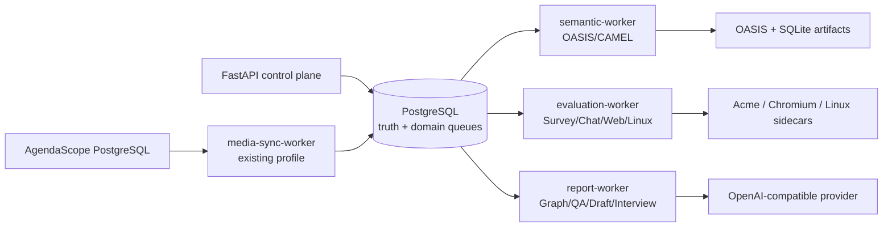

# Worker Architecture Review

审阅范围：SandOwl 当前工作树中的 Python 3.11 OASIS worker、PostgreSQL 持久队列、执行器 readiness、Compose 拓扑和 AgendaScope media sync worker。本文只做 Phase 2 设计，不改变代码、迁移或运行服务。

审阅依据包括：

- `backend/oasis_worker/src/oasis_worker/daemon.py`
- `backend/oasis_worker/src/oasis_worker/queue.py` 与各领域 `*_queue.py` / `*_engine.py`
- `backend/app/*/repository.py` 中的 readiness 与 claim 前置条件
- `backend/app/simulations/models.py`、Core Alembic migrations
- `backend/app/media/sync_worker.py`、`backend/app/media/sync_repository.py`
- `compose.yaml`、现有 Phase 1 运行记录

## 1. 当前架构

### 1.1 进程入口与 Compose 拓扑

控制面和执行面已经分开，但执行面目前仍是一个多领域进程：

| 进程 | 入口 | 当前职责 | 是否使用 OASIS worker 心跳 |
|---|---|---|---|
| API | `backend/app/main.py`、FastAPI | 创建 sealed 输入、提交队列、读取状态和报告 | 否；读取心跳决定可执行性 |
| OASIS worker | `python -m oasis_worker daemon`，`backend/oasis_worker/src/oasis_worker/cli.py` | 领取并执行 platform smoke、Semantic、Survey、Chat、Web、Linux、世界图和报告相关异步任务 | 是 |
| fixed sidecars | `acme-support-sample`、`acme-support-mcp-sample`、`matraix-web-browser`、`matraix-linux-runner` | 给 Chat/Web/Linux 提供固定、受限的 SUT/执行器 | 否；由 OASIS worker 启动探测 |
| media sync worker | `python -m app.media.sync_worker`，Compose profile `media-sync` | 从 AgendaScope 源库全量扫描并幂等投影到 SandOwl | 否；有自己的 `media_sync_runs` 状态 |

`compose.yaml` 中的 `oasis-worker` 使用 Python 3.11 镜像，这是 OASIS 0.2.5 的运行约束。它同时依赖四个 sidecar 的 `service_healthy` 条件，并把四个 sidecar URL 和三项 LLM 配置全部注入同一个容器。因而 Compose 层已经把五类执行器放进了同一启动边界。

`media-sync-worker` 是一个有意隔离的例外：没有 API 端口、没有 OASIS 依赖，也不使用 OASIS 心跳。它使用目标 PostgreSQL 上的会话级 advisory lock，完整导入期间保持目标事务；并发尝试写入 `skipped_concurrent`，不会在目标库中排队等待。

### 1.2 Daemon 启动和 readiness

`load_daemon_settings()` 先读取 `DATABASE_URL`、`OASIS_ARTIFACT_ROOT`、`OASIS_WORKER_ID`，再按环境变量派生运行配置：

1. 完整的 `LLM_API_KEY`、`LLM_BASE_URL`、`LLM_MODEL_NAME` 同时启用 Semantic 和 Survey 配置。
2. 同时存在 REST/MCP SUT URL 才启用 Chat 配置。
3. 存在浏览器 URL 才启用 Web 配置。
4. 存在 Linux runner URL 才启用 Linux 配置。

这一步是“配置存在”，不是“运行时可用”。`run_daemon()` 随后按固定顺序创建并探测：

```text
OASIS/CAMEL 依赖
  -> Semantic provider tool-call probe
  -> Survey provider probe
  -> Chat provider + REST/MCP SUT probe
  -> Web provider + browser probe
  -> Linux provider + runner probe
  -> 一次性写入完整 worker heartbeat
```

启动时会先写一条仅带基础字段的心跳，之后才运行上述探测。任一探测在有界重试后失败，整个 `try` 抛出 `OasisWorkerError`，不会发布包含已通过领域的最终心跳；失败心跳最终因 `last_seen_at` 超过 30 秒而失效。这正是本次 Phase 1 观察到的耦合：Semantic provider probe 已成功，但 Chat 的 Acme SUT identity drift 使 daemon 在完成最终心跳前退出，API 看到的 Semantic-ready 也随之消失。

运行中，主循环每秒轮询，另有线程每 5 秒更新一次 `simulation_worker_heartbeats`。心跳固定记录 OASIS/CAMEL 版本、worker id、`platform_runtime_ready`，以及 Semantic、Survey、Chat、Web、Linux 的 model/config/prompt 或 executor identity。API 端 readiness 只接受最近 30 秒内、版本正确且配置摘要唯一一致的心跳。

当前各 API 的 readiness 已经按领域提供：

- `/api/v2/simulations/oasis/semantic-readiness`
- `/api/v2/matraix/survey-readiness`
- `/api/v2/matraix/chat-readiness`
- `/api/v2/matraix/web-readiness`
- `/api/v2/matraix/linux-readiness`

但这些“读取端”虽然分别过滤领域字段，仍依赖同一条 worker 心跳和相同的基础条件。数据库 check constraint 也把各领域的 ready 状态绑定到 `platform_runtime_ready` 和 `semantic_runtime_ready`；这使当前心跳模型天然是 OASIS 多功能 worker 模型，而不是通用领域 worker 模型。

`/readyz` 和 `/api/v2/system/readiness` 只检查 API 的数据库连接及可选 Redis 配置，不代表任何 LLM、OASIS、Survey、Chat、Web 或 Linux runtime ready。这一点应继续保持，避免部署 liveness 和执行能力 readiness 混为一谈。

### 1.3 Queue 与 job dispatch

当前 PostgreSQL 队列不是一张通用 `jobs` 表，而是多个领域表和对应的 Python queue adapter：

| 当前 queue kind | 持久表 | claim/engine |
|---|---|---|
| `smoke` | `simulation_runs` | `claim_platform_smoke_run()` / `engine.run_job()` |
| `semantic` | `semantic_trials` | `claim_semantic_trial()` / `semantic_engine.run_semantic_trial()` |
| `world_graph` | `semantic_world_graphs` | `claim_world_graph()` / `extract_world_graph()` |
| `report_qa` | `report_questions` | `claim_report_question()` / `answer_report_question()` |
| `report_agent_draft` | `report_agent_cited_drafts` | `claim_report_agent_draft()` / `generate_report_agent_draft()` |
| `persona_interview` | `persona_report_interviews` | `claim_persona_interview()` / `answer_persona_interview()` |
| `survey` | `matraix_survey_trials` | `claim_survey_trial()` / `run_survey_trial()` |
| `chat` | `matraix_chat_trials` | `claim_chat_trial()` / `run_chat_trial()` |
| `web` | `matraix_web_trials` | `claim_web_trial()` / `run_web_trial()` |
| `linux` | `matraix_linux_trials` | `claim_linux_trial()` / `run_linux_trial()` |

`_claim_next_job()` 对所有已配置领域分别读取一个 queue head，组成 `(created_at, kind, id)` 候选列表，取全局最早项（同时间按 kind、id 稳定排序），再调用对应的 claim 函数。claim 函数在事务中使用 `FOR UPDATE SKIP LOCKED`，验证 sealed input、model/config/prompt identity 和内容哈希后，把 `queued` 改为 `running`。因此当前实际是：

- 单个 daemon 进程内的多队列、全局 oldest-first、一次只执行一个 job；
- 多个不同 worker id 理论上可以并发 claim，因为每个领域 claim 使用行锁；
- 但 Compose 默认只有一个 OASIS worker，并且同一进程不会并行执行两个 job；
- Python 中的 `kind` 是 dispatch 元数据，不是数据库中统一持久化的 job type；
- `media-sync-worker` 不在这组队列中，使用独立 `media_sync_runs` 生命周期。

终态由各领域表分别保存。大多数任务是 `queued -> running -> succeeded/failed`；Semantic 还会在 running 状态逐轮追加事件并推进 `current_round`。worker 启动和主循环都会把拥有者重启或 heartbeat 过期的 running 任务标记为 failed。当前没有 job-level `lease_id`、`lease_expires_at` 或安全的原地 resume；“worker heartbeat 仍活着”就是任务仍可被认为拥有的唯一依据。

### 1.4 Engine 与领域边界

| 领域 | 真实执行内容 | 当前 runtime 依赖 | 与其他领域的耦合 |
|---|---|---|---|
| Platform smoke | 一个 synthetic actor 在 Reddit 写入手工 `CREATE_POST`，校验 SQLite artifact | OASIS/CAMEL；`StubModel`，不需要 LLM | 与 Semantic 共用 OASIS 版本、daemon 和 platform heartbeat，但不应要求五类 LLM readiness |
| Semantic | Sealed Scenario × Cohort × seed 的 OASIS/CAMEL 受众动作，逐轮写 typed events | OASIS/CAMEL + OpenAI-compatible provider | 当前与平台 heartbeat、Survey 配置派生和所有同进程探测耦合 |
| Survey | 固定三题场景偏好 Survey，逐 Persona 生成严格 tool-call answer | provider + Survey prompt contract | 当前复用 Semantic provider config 和同一 daemon；失败会阻断整个 daemon 启动 |
| Chat | 固定 Acme REST/MCP source sample，多轮 transcript 与 typed feedback | provider + 两个固定 SUT + Chat identity | 额外依赖 SUT identity；任何 drift 会阻断 Semantic、Survey、Web、Linux 和 Report 的同进程启动 |
| Web | 固定 Quotes to Scrape Playwright quote-choice，保存页面和截图 | provider + 独立 Chromium sidecar | 浏览器或 executor identity drift 会阻断同进程所有领域 |
| Linux | 固定 note-to-CSV 任务，调用非特权 runner 并封存 artifact | provider + Linux runner sidecar | runner 失败会阻断同进程所有领域，并涉及更高安全/资源边界 |
| World graph | 从 sealed WorldSnapshot 证据抽取 evidence-backed nodes/edges | provider + graph prompt contract | 当前作为 Semantic config 下的 queue job 与 Semantic 共进程 |
| Report | DecisionReport 本身由控制面根据成功 Experiment comparison 生成；Report QA、bounded ReportAgent draft、Persona interview 是异步 LLM job | provider + sealed snapshot/graph/report/Cohort 读取 | 当前全部复用 Semantic config、daemon、heartbeat 和全局 job 顺序 |
| Media | AgendaScope 全量只读扫描、变更 upsert、同步状态和水位 | AgendaScope PostgreSQL + SandOwl PostgreSQL | 已与 OASIS 进程分离，但通过同一目标库和事务/lock 产生数据库资源竞争 |

这里的 Report 不是通用 Agent runtime。当前只有固定的证据边界工具和领域专用 engine；没有通用 `Agent`、planner、tool registry 或 LangGraph。

## 2. 问题分析

### 2.1 当前共享一个 worker 的优点

- **部署面小**：一个 Python 3.11 image、一个 Compose service、一个 worker id 和一套数据库连接即可运行全部已接通执行器。
- **版本与配置校验集中**：OASIS/CAMEL 固定版本、LLM model/config digest、prompt schema 都在一次启动探测中确认；各 queue claim 还会再次校验 digest。
- **已有领域 adapter 可复用**：各 queue 表、engine、hashing、状态约束均已分开，daemon 只负责组合 dispatch，不需要通用 Agent 抽象。
- **当前规模下调试容易**：所有 job 都在同一个日志进程，global oldest-first 使小队列不容易被某一张表永久饿死。
- **数据库事实源不变**：拆分进程不需要改变 Evidence、Experiment、Observation、Report 的数据模型；队列仍可留在 PostgreSQL。

### 2.2 当前共享一个 worker 的缺点与风险

#### 启动与 readiness 的 blast radius

`run_daemon()` 把 Semantic、Survey、Chat、Web、Linux 的 provider/sidecar probe 放在同一个异常边界内。任何一个 probe 抛错，进程退出，已经成功的领域也没有机会发布完整 ready 心跳。Chat 的 Acme SUT identity drift 已经证明这是实际故障，不是理论风险。

数据库约束进一步强化了这种组合式语义：Survey、Chat、Web、Linux ready 都要求 platform 和 semantic ready。结果是“某领域不可用”会被投影成“整个同进程 OASIS worker 无法提供语义执行”，即使 Semantic provider 和 OASIS 本身没有问题。

#### 执行资源和队列互相影响

- daemon 一次只执行一个 job；一个长 Semantic trial、Web 浏览器等待或 Linux runner 卡住，会延迟报告 QA、ReportAgent draft 和其他短任务。
- `_claim_next_job()` 虽然跨表选最早 job，但没有 domain quota、priority、deadline 或 per-domain concurrency；global fairness 换来了 head-of-line blocking。
- 同一个 provider 配置被多个领域复用，任何一类工具调用参数或 SUT 反馈异常都可能消耗相同的启动/重试边界。
- 所有 artifact 写入同一个 OASIS worker 的挂载根目录，拆分前没有按领域的资源上限或并发隔离策略。

#### 运维与安全边界不清

- Chat 需要两个内部 HTTP SUT，Web 需要 Chromium，Linux 需要 runner；它们的网络、凭据、超时和故障模式不同，却由同一进程统一初始化。
- Linux runner 虽然自身是非特权 sidecar，但 Linux job 与普通 LLM/报告 job 共享 worker 进程、日志和进程资源，后续不能单独施加资源预算。
- Report 任务读取 sealed evidence，Semantic 任务写入 OASIS/SQLite；两者的失败恢复、审计和数据访问边界不同，当前却都依赖 `simulation_worker_heartbeats`。

#### 恢复语义不足

现有 orphan 处理是 worker 级 heartbeat 失活后，把该 worker 领取的任务标记为 failed。它没有 job lease/fencing token，也不能区分“worker 还活着但某一个 job 卡住”和“worker 进程死亡”。拆分后如果继续只靠 worker heartbeat，报告 worker 或 evaluation worker 的单 job 故障仍可能长时间占住 running 状态。

AgendaScope sync 另有自己的会话 advisory lock，并在一次导入中保持目标事务。它已经与 OASIS worker 进程分离，但仍会在全量导入期间对目标 PostgreSQL 产生长事务/锁竞争；这一类数据库资源问题不能靠 OASIS worker readiness 解决，应该在 media domain 的运行策略中独立观察。

### 2.3 Semantic、Survey、Chat、Web、Linux、Report 是否应该共享

结论不是“每个 engine 一个服务”，而是按故障边界和执行语义分组：

| 领域 | 继续与谁共享 | 是否应与 Semantic 共进程 | 理由 |
|---|---|---|---|
| Semantic | Platform smoke；可选同组的 OASIS 基础能力 | **不应与 evaluation/report 共享** | 是当前 Vertical Slice 的核心、运行时间最长，且需要独立证明 LLM/OASIS readiness |
| Survey | Chat/Web/Linux 组成 bounded evaluation group | **不应依赖 Semantic readiness** | 同为 MatrAIx 评测，但 tool contract 和结果模型不同；共享 evaluation process 可以减少拆分数量，readiness 必须独立 |
| Chat | Evaluation group；Acme REST/MCP 作为独立 sidecar | **不应** | SUT identity drift、双通道协议和多轮 transcript 是最容易发生外部契约变化的边界 |
| Web | Evaluation group；Chromium 作为独立 sidecar | **不应** | 浏览器/截图/超时/产物生命周期与 OASIS 语义运行不同；先在同一 evaluation process 中能力隔离，必要时再单独进程 |
| Linux | Evaluation group；runner 作为独立 sidecar | **不应** | 安全与资源边界最强；可以先逻辑隔离，不能让 Linux readiness 决定 Semantic |
| Report | Report/analysis group；World graph、QA、ReportAgent draft、Persona interview 可同组 | **不应** | 主要读取 sealed evidence，属于分析输出，不应被社交模拟或 Chat SUT 失败阻断；DecisionReport 主体仍由 API 同步生成 |

短期可接受的共享边界是：`semantic-worker` 共享 Platform smoke，`evaluation-worker` 共享四类 MatrAIx evaluation，`report-worker` 共享 graph/QA/ReportAgent/Interview。共享的前提是“每个 capability 的探测、claim 和 readiness 独立”，而不是再建立一个 all-or-nothing worker。

## 3. 推荐架构

### 3.1 推荐 topology



| Worker | 第一阶段职责 | 独立 ready 条件 | 是否需要新 Agent 抽象 |
|---|---|---|---|
| `semantic-worker` | `semantic_trials`；`simulation_runs` platform smoke；可暂时承载 `semantic_world_graphs`，若 graph 负载很小 | OASIS/CAMEL 版本、artifact root、Semantic provider probe；Platform smoke 另有独立 capability | 否，复用现有 queue/engine |
| `evaluation-worker` | `matraix_survey_trials`、Chat、Web、Linux | 每个 evaluation capability 单独记录 provider、prompt、SUT/executor identity；某个 capability 失败只使该 capability unavailable | 否，仍是四个固定 engine |
| `report-worker` | `semantic_world_graphs`（若不放 semantic）、`report_questions`、`report_agent_cited_drafts`、`persona_report_interviews` | evidence/report prompt、sealed graph/snapshot 读取、provider probe；不需要 Chat/Web/Linux readiness | 否，ReportAgent 仍是 bounded evidence tool runner |
| `media-sync-worker` | AgendaScope source scan 与 target projection | source schema/credentials/target DB 可用；独立 sync status | 否，保持已有独立实现 |

`DecisionReport` 的基础生成仍属于控制面：API 在成功 Semantic Experiment comparison 上生成固定、内容寻址、sealed report。`report-worker` 只承载报告问答、证据工具草稿、Persona 合成访谈和必要的 evidence graph 抽取，不把同步报告生成改造成通用 Agent。

### 3.2 为什么不立即按六个领域拆成六个进程

- Platform smoke 与 Semantic 共享 OASIS/CAMEL 运行依赖，且前者无 LLM；拆成两个服务会先增加 Compose、artifact、版本和部署维护成本，收益有限。保留同组，但发布两个 capability readiness。
- Survey、Chat、Web、Linux 都是固定 MatrAIx 评测，输入/输出和重试谱系相似；第一步只拆离 Semantic/Report，已经能消除本次故障的核心 blast radius。Chat/Web/Linux 后续可单独进程化，尤其是在它们需要不同并发/网络/凭据策略时。
- World graph 与 Report 都消费 sealed snapshot 并产生证据约束分析资料，短期可以跟 Report 同组；若 graph extraction 变成高 CPU/高 token 批处理，再单独成为 evidence-worker。
- Media sync 已经独立，不应为了统一队列而重新并入 OASIS daemon。

### 3.3 关键行为改变

1. Worker 进程启动只对自身域的必需 capability 失败才退出；同组的可选 capability 采用 `ready / degraded / unavailable` 记录，不阻断其他 capability。
2. 每一个提交 API 只查询与 job type 相匹配的 capability heartbeat；Chat 不再是 Semantic 入队的前置条件。
3. 同一 capability 存在多个 live worker 时，必须有一个唯一的 model/config/contract identity；若存在冲突则只阻断该 capability，不阻断其他域。
4. 所有 job 仍引用 sealed Scenario、WorldSnapshot、Cohort、Experiment 或 Report 的 ID 和 hash；拆进程不改变 Evidence → Experiment → Observation → Report 事实边界。
5. 每个 worker 共享 PostgreSQL 事实源，但 artifact、网络、环境变量和日志上下文按 domain 分组；不引入消息总线或通用 Agent runtime。

## 4. Queue 设计

### 4.1 PostgreSQL 是否能支持多个 worker domain

**能，但当前实现只能算“多个领域表 + 一个 dispatcher”，还不是 domain-aware worker topology。** PostgreSQL 的事务、`FOR UPDATE SKIP LOCKED`、sealed input、状态约束和 heartbeat orphan 处理已经足够支撑第一版多 worker。M1 需要补充的是进程 role、可领取 job kind allowlist 和领域化 readiness，而不是替换 PostgreSQL，也不是先重做队列表。

当前独立表的优点是各领域 payload、hash 和状态约束清晰；不建议为了抽象而立即把 Semantic event、Chat transcript、Web screenshot、Linux artifact 和 Report citation 合并成一个 JSON job 表。

### 4.2 Job type 与 capability

建议建立稳定的 canonical job type（名称只是设计建议）：

| Domain | `job_type` 示例 | `required_capability` 示例 |
|---|---|---|
| semantic | `simulation.platform_smoke`、`simulation.semantic_trial` | `oasis.platform.v1`、`oasis.semantic.v1` |
| evaluation | `evaluation.survey`、`evaluation.chat`、`evaluation.web`、`evaluation.linux` | `matraix.survey.v1`、`matraix.chat.acme.v1`、`matraix.web.quotes.v1`、`matraix.linux.note_csv.v1` |
| report | `analysis.world_graph`、`report.qa`、`report.agent_draft`、`report.persona_interview` | `evidence.graph.v1`、`report.qa.v1`、`report.draft.v1`、`report.interview.v1` |
| media | `media.agendascope_sync` | `media.agendascope.import.v1` |

`job_type` 表示要执行哪个固定 engine；`required_capability` 表示 worker 经过了哪个版本化 probe、拥有哪个 SUT/executor 和输入输出契约。两者都不能从一个模糊的 `worker_type=agent` 推断。

M1 不需要把 `job_type` 或 `required_capability` 重复写入每个领域表：表名和 queue adapter 已经构成稳定的 job type，daemon 可以用一张显式静态映射把 queue kind 映射到 capability，并按进程 role 形成 allowlist。claim 继续检查 status、sealed input 和 model/config/prompt/executor identity。只有 M1 运行后出现动态路由、跨版本 worker 或运维查询需求，才在 M2 评估 companion routing metadata；不要为了形式统一先建立通用 payload 表。

### 4.3 Worker lease

当前 `claimed_by_worker_id + started_at + heartbeat` 只能说明“哪个进程曾领取”，不能提供独立于进程心跳的 job 期限；但 orphan 当前会直接转成 failed，而不是自动把同一 job 重新派发，因此 worker 隔离本身不依赖一次全面 lease migration。M1 先保留这一 fail-closed 语义并观测 stalled/orphan 行为。若以后引入自动重派、取消或 resume，M2 应为每个 queued/running job 增加：

- `lease_id`：每次 claim 唯一 UUID，作为 fencing token；
- `leased_at`、`lease_expires_at`：明确本次领取期限；
- `last_progress_at` 或领域 progress cursor：区分 heartbeat 活着但 job 不动；
- `attempt_number`：若允许重新排队，新的 attempt 必须是新的不可变记录，不覆盖旧观察。

届时 claim 仍使用 `FOR UPDATE SKIP LOCKED`，但 complete/fail/append event 必须同时校验 `job_id + worker_id + lease_id`。租约过期的默认处理应是明确失败并保留原因；Semantic 已经追加事件时，不应未经 idempotency 设计就自动把同一个 trial 原地重放。可重试任务应创建新的 attempt/lineage，延续现有 Survey/Chat/Web/Linux 的不可变重试思路。

### 4.4 Heartbeat 与 readiness

当前 `simulation_worker_heartbeats` 是 OASIS 专用、每 worker 一行的宽表。M1 可以先增加一个严格的 `worker_domain`（`semantic` / `evaluation` / `report`）并复用已有各能力字段：这样 Semantic readiness 不会把“只配置了同一 LLM、但不领取 Semantic job 的 report worker”误判成 Semantic worker。各 API 按 domain 与对应 ready 字段查询即可。

如果 M1 后仍需要独立扩展 capability 状态，再在 M2 规范化为两个结构化概念：

1. `worker_process_heartbeats`：worker id、domain、process start、last seen、运行时版本、进程状态。
2. `worker_capability_heartbeats`：worker id、capability、ready 状态、model/config digest、prompt/executor contract version、last probe、failure code。

M1 保留旧宽表及现有 readiness response shape，只新增 domain 过滤和按能力独立探测；Report worker 暂时复用同表是兼容过渡。M2 的规范化表再消除 Report worker 被迫使用 `engine='camel-oasis'` simulation heartbeat 的语义错位。

readiness 必须从组合式改为 capability 级：

| capability | 必需条件 | Chat/SUT 或其他域失败的影响 |
|---|---|---|
| `oasis.platform.v1` | OASIS/CAMEL、artifact 路径和 DB claim 能力 | 不影响 Semantic provider |
| `oasis.semantic.v1` | OASIS/CAMEL + LLM tool-call probe + semantic contract | 不受 Chat/Web/Linux 影响 |
| `matraix.survey.v1` | provider + Survey schema probe | 只影响 Survey |
| `matraix.chat.acme.v1` | provider + REST/MCP SUT identity/probe | 只影响 Chat |
| `matraix.web.quotes.v1` | provider + browser/executor identity/probe | 只影响 Web |
| `matraix.linux.note_csv.v1` | provider + runner identity/probe | 只影响 Linux |
| `report.*` / `evidence.graph.v1` | provider + evidence/report contract，读取 sealed input | 只影响对应报告/图任务 |

同一 capability 的多个心跳配置摘要不一致时，只阻断该 capability 的新 job；不同 capability 可以使用同一个 LLM provider，但要保留各自的 config digest 和 prompt schema。ready、degraded、unavailable、misconfigured 应在 API 中区分，不能把“worker 在线”直接等同于“所有任务可执行”。

### 4.5 Claim、公平性和数据库索引

拆分后，domain worker 不再扫描所有 queue head，只扫描自身 capability 对应的表/索引。每个 domain 内按 `created_at, id` oldest-first 即可；同一进程如果承载多个 capability，再在这些 capability 的 head 中做稳定选择。M1 由进程 allowlist 决定扫描范围，现有领域索引继续使用；若 M2 引入 companion routing metadata，再按实际查询计划增加索引。

这会消除当前 global dispatcher 的跨域 head-of-line blocking。它不需要 Redis、Kafka、Celery 或新的 Agent framework；PostgreSQL 仍是 durable queue 和事实源。

## 5. Migration Plan

### M0：不改代码（本 Phase 设计基线）

本阶段只记录设计和运行事实：

- 保留当前单一 `oasis-worker` 和 `media-sync-worker` 拓扑；
- 用现有五类 readiness endpoint 分别观测 Semantic、Survey、Chat、Web、Linux；
- 在运行记录中区分“provider probe 失败”“SUT identity drift”“sidecar 不健康”“队列领取/执行失败”；
- 将本次 Chat identity drift 作为隔离验证用例：确认 Semantic readiness 是否因同进程启动失败而丢失；
- 记录各 queue 的等待时间、运行时间、orphan 数量和报告任务是否被 Semantic 长任务阻塞；
- 不改变 `Evidence → Experiment → Observation → Report`、现有表、状态机和 report 语义。

### M1：最小隔离

目标是先消除故障传播，不追求完整分布式平台：

1. **显式进程 role**：为 daemon 增加严格的 `worker_domain` / job-kind allowlist；未在 allowlist 中的 queue 不 probe、不扫描、不清理、不 claim。
2. **最小 heartbeat 区分**：在现有宽表上记录 `worker_domain`，保留已有各能力配置字段和 API response shape；readiness 查询同时匹配 domain 与 capability，避免 report worker 造成 Semantic false-positive。
3. **进程分组**：Compose 先运行 `semantic-worker`、`evaluation-worker`、`report-worker` 三个 domain service，可复用同一 worker image 和现有 queue/engine；`media-sync-worker` 保持原 profile。
4. **独立启动探针**：semantic worker 不装载 Chat/Web/Linux；report worker 不等待 evaluation；evaluation worker 对 Survey/Chat/Web/Linux 分别 probe，单项失败只把该项标成 unavailable，其他项继续运行。
5. **Domain-aware dispatch/reaper**：每个进程只在自己的 queue 集合中 oldest-first，并只处理自己领域的 orphan 检查；现有领域表、hash、typed events、artifact 和 terminal ownership 语义保持不变。
6. **API readiness 按 domain/capability 查询**：Semantic experiment 只接受 semantic worker 发布的 `oasis.semantic.v1`；Chat 只接受 evaluation worker 的 `matraix.chat.acme.v1`。
7. **暂不引入通用路由和 lease**：M1 不新增统一 job envelope、不复制 `job_type` 字段、不改变 retry/resume；先通过实际运行数据决定 M2 是否需要。

M1 结束的验收标准是：关闭或制造 Chat identity drift 时，Semantic readiness 和一个 Semantic trial 仍能完成；Chat job 被准确标为 unavailable/failed，且不会被错误地标成 Semantic failure。

### M2：完整拆分（未来设计，不在本阶段执行）

只有在 M1 的队列指标和故障边界证明有必要时才推进：

- 按独立 image/网络/凭据/资源配额拆分 Chat、Web、Linux，必要时把 graph extraction 拆成 evidence-worker；
- 若 M1 指标证明需要动态路由，再引入只承载 job type/capability/lease/attempt/priority 的 `execution_jobs` envelope 或 companion metadata；领域表继续保存强类型 payload 与观察；
- 在开始自动重派、取消或 resume 前增加 job-level lease/fencing token 和 progress 语义；
- 增加每域并发、rate limit、成本预算、artifact retention、取消和可恢复 checkpoint；
- 只在真实吞吐和运维需求出现后引入 autoscaling 或额外消息基础设施；
- 建立跨 worker metrics/trace，但不把 worker 变成通用 Agent supervisor；
- 为 report-worker 建立更细的 evidence graph / ReportAgent draft 独立 SLA，而不是开放自主 ReAct。

M2 仍必须把执行产物当作 Observation 或分析草稿；不能把多 worker 拆分误写成预测能力、因果引擎或通用 Agent OS。

## 6. M1 实施与运行验收（2026-08-16）

M1 已按本设计的最小边界落地，未引入统一 job 表、通用 Agent 抽象或新消息基础设施：

- migration `20260816_core_0041` 为瞬时 heartbeat 增加严格 `worker_domain`，升级时清理旧 combined heartbeat；
- daemon 以 job-kind allowlist 限制 probe、queue scan、claim、orphan cleanup 和 shutdown cleanup；
- Compose 已运行 `semantic-worker`、`evaluation-worker`、`report-worker`，media sync 继续独立；
- Semantic readiness 只读取 semantic domain；Survey、Chat、Web、Linux 只读取 evaluation domain；
- evaluation 中单一 capability probe 失败只关闭该能力，不再使整个 worker 退出。

真实 PostgreSQL 已从 `0032` 顺序迁移到 `0042`。运行时三个 heartbeat 均独立存在：semantic 与 report 发布 `semantic_runtime_ready=true`，evaluation 发布 Survey/Chat/Web/Linux 四项 ready。Acme REST/MCP 使用包含 contract hash 的 image tag 重建后，Chat readiness 恢复为 true；Semantic readiness 在整个过程中保持独立为 true。

M1 已满足本次故障隔离目标。当前运行数据没有证明必须立即执行 M2；job lease、统一 routing envelope 和更细粒度 worker 拆分继续保留为有指标依据时的后续项。
