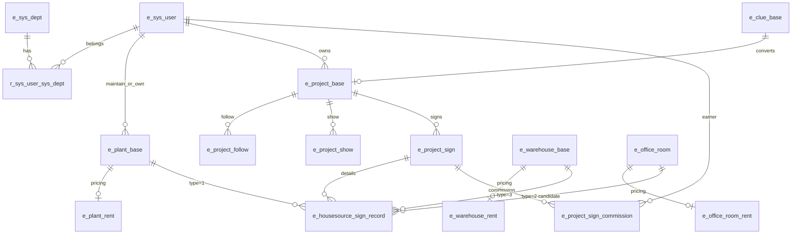

# GTV 成交推演 — 数据字典与 ER（G0）

> 源库：`lyy_manage` SQL dump（`/Users/ssyb/Downloads/data/lyy_manage`）  
> 派生：`backend/scripts/gtv_forecast/_data/`（gitignore，已脱敏）

## ER（核心）

## 表与用途

| 表 | 角色 | 关键字段 | ID 类型注意 |
|----|------|----------|-------------|
| `e_sys_user` | 经纪人主体 | `user_id`, `nick_name`, `engage_time`, `status`, `del_flag` | PK bigint；勿用空瘦 `t_broker_info` |
| `r_sys_user_sys_dept` / `e_sys_dept` | 门店/团队 | `user_id`, `dept_id`, `dept_name` | `e_sys_user.dept_id` 已作废 |
| `e_plant_base` | 厂房 | `maintain_person_id`, `user_id`, 城市, `follow_num`, `show_num`, `up_time`, `status`, `create_time` | status=当前上下架 |
| `e_warehouse_base` | 仓库 | 同构 | |
| `e_office_base` / `e_office_room` | 办公楼栋/房间 | room 有 `maintain_person_id`, `follow_num`, `show_num` | **G0 已确认**：签约 `type=2` 的 `housing_resource_id` 挂 `e_office_room`（~97%），非 `e_office_base` |
| `e_*_rent` | 租金/售价 | `rent_price_*`, `sale_price`, `rent_convert_*` | 与 base 1:1 |
| `e_clue_base` | 线索 | `deal_type`, `plan_time`, `project_id`, `project_manager` | phone 等 PII 已丢弃 |
| `e_project_base` | 项目 | `project_stage`, `user_id`, 价格区间 | |
| `e_project_follow` / `e_project_show` / `e_*_follow` | 行为时序 | 时间戳 + 主体 id | 文本内容已丢弃 |
| `e_housesource_sign_record` | **成交主标签** | `housing_resource_id`, `sign_type`, `type`, `status`, `create_time`, `project_sign_id` | status 0审批中/1通过/2驳回 |
| `e_project_sign` | 合同/金额/时间 | `contract_time`, `status`, `housing_resource_id`, 金额 | 约半数无 housing_resource_id |
| `e_project_sign_commission` | **开单归因** | `project_sign_id`, `user_id`, `user_type`, `commission_rate` | |
| `e_plant_operate_record` | 操作日志 | `type`, `title`, `operate_time` | 样本中多为录入/编辑，**无可靠上下架事件** |

## 标签定义（写死）

| 问题 | 正样本 | 负/删失 |
|------|--------|---------|
| 房源成交 | `e_housesource_sign_record.status=1` | 窗口结束未成交 |
| 租/售 | `sign_type`∈{1,3}→租；{2,4}→售 | |
| 经纪人开单 | 佣金表 `user_id` 关联已通过签约；回退 project.user_id / maintain_person_id | 窗口无归因 |
| 何时 | `contract_time` 优先，否则 sign_record.create_time；`T_sign - T0` | 未成交右删失 |

## 「T0 时在架」说明

`status` 仅为当前态；`e_*_operate_record` 未见稳定的上架/下架 type。  
**负样本近似定义**：`create_time < T0` 且 `T0` 前未成交（不要求历史在架可重构）。报告中声明该偏差。

## 枚举速查

- `housesource.type`：1 厂房 / 2 办公 / 3 仓库  
- `sign_type`：1 整栋出租 / 2 整栋出售 / 3 部分出租 / 4 部分出售  
- `sign.status`：0 审批中 / 1 已通过 / 2 已驳回  
