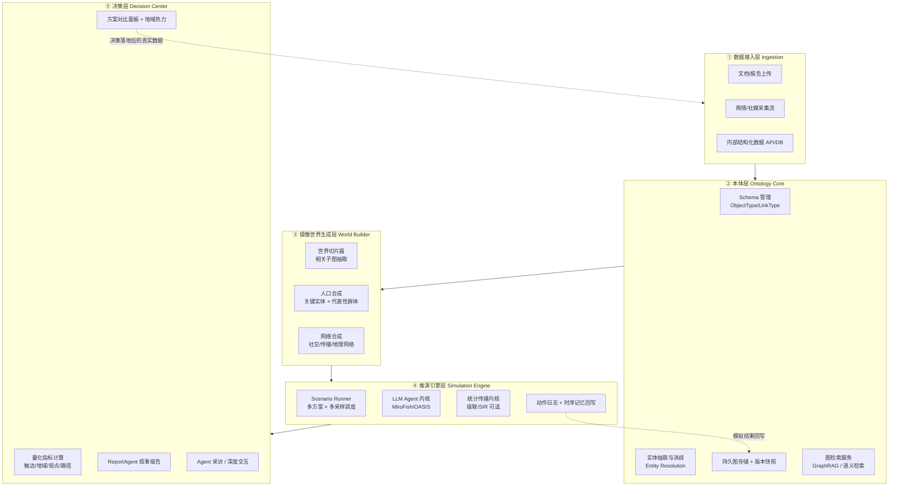

# AI 决策中心 — 方案设计

> 版本：v0.1（2026-07）· 状态：设计讨论稿
>
> 核心公式：**AI 决策中心 = 持久本体层（Palantir/Ontology 思路） + 群体智能推演引擎（MiroFish/OASIS） + 决策对比闭环**

---

## 1. 定位与核心命题

### 1.1 一句话定义

用户在一张"活的"现实世界本体图谱上圈定一个**干预**（发布某篇文章 / 某项政策 / 某条短视频），系统从本体切出相关的**世界切片**，合成 Agent 人口与传播网络，推演引擎并行推演 **N 个方案 × M 次采样**，决策面板给出传播范围（地域热力）、观点分布（赞成/反对/圈层）、关键传播路径与风险点的**量化对比**，辅助人做最终决策。

### 1.2 两个母体各自解决什么

| | Palantir / Ontology | MiroFish |
|---|---|---|
| 回答的问题 | **现在世界是什么样**（ground truth） | **如果做 X 世界会怎样**（counterfactual futures） |
| 核心资产 | 对象化的现实（Object/Property/Link）+ 与数据源持续同步 + Action 写回 | Zep 本体抽取 → LLM Persona → OASIS 双平台社会模拟 → ReportAgent |
| 缺失的 | 生成式 Agent 社会模拟（只有静态 scenario） | 持久本体（项目级一次性图谱，用完即弃）、量化决策对比、校准 |

两者互补性极强：本体层给推演提供"世界状态底座"，推演引擎给本体层提供"向前看的能力"。

### 1.3 与 MiroFish 原版的本质区别

MiroFish 当前的模式是"上传文档 → 一次性建图 → 一次性模拟 → 叙事报告"，本体是模拟的**附属品**。决策中心将其倒置：**本体是常驻的一等公民**，模拟是架在本体上的可反复调用的服务，且从"单次模拟出报告"升级为"多方案 × 多采样出对比"。

---

## 2. 概念模型（领域语言）

先统一词汇，后续所有模块围绕这六个概念展开：

| 概念 | 定义 | 类比 |
|---|---|---|
| **Ontology（本体）** | 常驻的现实世界模型：ObjectType（人/组织/事件/内容/地域…）+ Property + LinkType，与数据源持续同步、带版本 | Palantir Ontology |
| **World Slice（世界切片）** | 针对一次推演，从本体中按相关性切出的子图快照（含时间戳/版本号），是推演的初始世界状态 | 存档点 |
| **Population（Agent 人口）** | 由世界切片合成的 Agent 群：关键实体一对一映射 + 大众群体按分布合成 | 数字孪生居民 |
| **Intervention（干预）** | 待评估的动作：一篇文章、一项政策、一条视频、一次定价调整，附投放参数（渠道/时间/首发者） | 实验的自变量 |
| **Scenario（方案/情景）** | 世界切片 + 干预 + 推演参数 的组合；一次决策任务包含多个 Scenario（含"什么都不做"的基线） | 对照实验组 |
| **Run（推演）** | Scenario 的一次执行；同一 Scenario 跑 M 次采样得到结果分布而非单点 | 蒙特卡洛一次抽样 |

决策任务的形态：`Decision = {Scenario A, Scenario B, ..., Baseline} → 对比报告 → 人拍板 →（未来）Action 写回`。

---

## 3. 总体架构（五层）

关键数据流：本体只进不弃（持续累积），每次推演从本体**切片**而非重建；模拟产生的时序记忆可选择性回写本体（复用 MiroFish 的 `zep_graph_memory_updater` 机制）；决策落地后的真实结果重新进入数据接入层，形成校准闭环（见 §8）。

---

## 4. 各层设计

### 4.1 数据接入层（多源混合）

三类数据源对应三条管道，全部汇入统一的"实体候选 + 事实（episode）"中间格式，再进本体层：

1. **文档管道**（MVP 首先打通）：PDF/MD/TXT 上传 → 分块 → 抽取。直接复用 MiroFish 的 `text_processor` + `graph_builder`，改动最小。
2. **舆情/社媒流管道**：爬虫或第三方舆情 API（BettaFish 类采集）→ 清洗 → 增量抽取。要点是**增量更新**而非重建：新事实作为 episode 追加，实体消歧后合并到既有节点。
3. **结构化数据管道**：内部业务库/API 按 schema 映射直接落为 Object，不走 LLM 抽取（结构化数据走抽取是浪费且引入噪声）。

通用平台的关键设计：管道是**插件式**的，每个数据源实现统一的 `Connector` 接口（拉取 → 转中间格式 → 提交本体层），新场景只需加 connector 和 schema 模板，不动核心。

### 4.2 本体层（从"一次性"到"常驻"）

这是相对 MiroFish 改造最大的一层，四个子能力：

**Schema 管理。** 保留 MiroFish `ontology_generator` 的"LLM 根据领域自动设计实体/关系类型"能力作为冷启动，但增加：schema 显式管理（人可审阅、修改、锁定）、**场景模板库**（舆情传播 / 政策仿真 / 商业决策各一套预置 schema，通用平台靠模板而不是每次从零生成）、schema 演进（加字段不破坏既有数据）。

**实体消歧（Entity Resolution）。** 多源混合后同一实体会从不同源多次出现（"武汉大学" vs "武大" vs 某条微博提到的 WHU）。这是 MiroFish 完全没有、决策中心必须有的模块。方案：嵌入相似度粗召回 + LLM 精判 + 人工仲裁队列（低置信度的合并进队列）。

**持久存储与版本。** 存储选型（两条路，MVP 建议前者）：

| | 继续 Zep Cloud | Neo4j/自建图库 / 阿里云图库 + 自研检索 |
|---|---|---|
| 优点 | 复用 MiroFish 全部图谱代码、自带时序记忆和混合检索 | 数据自主、无配额限制、可做任意图算法（社区发现/中心性，网络合成需要） |
| 缺点 | 托管依赖、配额成本、图算法能力弱、数据出境顾虑 | 自研检索/时序记忆工作量大 |
| 建议 | **当前阶段用**（P1–P2），验证产品闭环 | **远期迁移目标**（自建或阿里云图库）；规模化或客户数据约束出现后再评估实施；网络合成需要的图算法可先导出到 NetworkX 内存计算 |

版本快照是推演可复现的前提：每个 World Slice 绑定 `ontology_version + timestamp`，同一决策任务的所有 Scenario 必须基于同一快照，否则对比无意义。

**图检索服务。** 复用 MiroFish 的 `zep_tools`（`insight_forge` / `panorama_search` / `quick_search`），升级为独立服务供切片器、Persona 生成、ReportAgent 共用。

### 4.3 镜像世界生成层（决策中心的独有增量）

MiroFish 从"文档里出现的实体"生成 Agent；决策中心要回答"传播到哪个城市、哪些人转发"，必须超出文档实体的范围。三个模块：

**世界切片器。** 输入：干预描述 + 本体。输出：相关子图。做法：以干预涉及的核心对象为种子，在本体上做 k-hop 扩展 + 语义相关性过滤，控制切片规模。切片是快照（不可变），推演期间本体继续更新不影响进行中的 Run。

**人口合成（Population Synthesis）。** 两级结构：

- **具名 Agent**：切片中的关键实体（KOL、官方机构、核心利益方）一对一生成，完全复用 MiroFish 的 `oasis_profile_generator`（Zep 上下文 → 2000 字 persona），这是 MiroFish 最值钱的现成能力。
- **代表性 Agent**：按目标人群的分布（地域 × 年龄 × 圈层 × 立场先验）合成"人群切片代言人"，一个 Agent 代表一个 cohort（如"武汉·25-34 岁·科技圈·中立偏支持"，权重 = 该 cohort 人口数）。分布数据来源：公开统计 + 舆情数据中的用户画像聚合 + 场景模板默认值。

**网络合成（Network Synthesis）。** MiroFish 的最大空缺：它不预建社交网，FOLLOW 全靠模拟中涌现，传播预测的结构基础不足。决策中心显式生成三层网络作为模拟初始条件：

1. **本体关系层**：Zep/图库中已有的关系边（WORKS_FOR、SUPPORTS…）直接映射为初始关注/信任边——补上 MiroFish "知识边 → 初始社交边"这个缺失的模块；
2. **统计连边层**：具名 Agent 与代表性 Agent 之间、代表性 Agent 相互之间，按同城/同圈层/影响力（度分布服从幂律）概率连边；
3. **地理层**：每个 Agent 挂城市标签，跨城边概率低于同城边，这是"传播到哪个城市"可计算的前提。

### 4.4 推演引擎层

**Scenario Runner（新增，编排核心）。** 职责：接收决策任务（多 Scenario）→ 为每个 Scenario 调度 M 次 Run（不同随机种子）→ 管理并发与预算（LLM token 上限、超时熔断）→ 收集结果。MiroFish 的 `simulation_manager/simulation_runner` 管"单次模拟的生命周期"，可作为 Run 级别的执行器被 Runner 调用。

**模拟内核：两方案对比（决策点，见 §5 详细分析）。**

**干预注入。** 复用 MiroFish 的 `event_config.initial_posts` 机制（指定 agent 发种子帖），扩展为通用的干预 DSL：`{内容, 首发者, 渠道, 时间, 投放强度}`。政策类干预不只是"一个帖子"，还包括环境变量修改（如 persona 上下文注入"新政策已生效"），这需要扩展 OASIS 的环境注入接口。

**动作日志与回写。** 复用 `action_logger`（actions.jsonl）+ `zep_graph_memory_updater`（回写本体，标记为 `simulated` 来源以免污染真实数据）。

### 4.5 决策层

MiroFish 的输出是叙事型 Markdown 报告；决策中心在其**前面**加量化层：

**指标计算（新增）。** 从 M 次 Run 的 actions/DB 聚合出结构化指标（均值 + 置信区间）：

- 传播：触达人数/人口占比、转发级联深度、峰值时间、衰减曲线
- 地域：分城市触达热力（靠代表性 Agent 的城市标签 × 权重换算回真实人口）
- 观点：赞成/反对/中立分布及其随时间演化、分圈层立场
- 结构：关键传播节点（谁是引爆点）、主要传播路径、意见领袖影响力排名
- 风险：负面情绪聚集的 cohort、极化程度、失控概率（M 次采样中传播超阈值的比例）

**方案对比面板（新增，产品核心界面）。** 多 Scenario 并排：地域热力图、观点分布对比、传播曲线叠加、风险清单。基线（不干预）永远在列。

**叙事报告与深度交互（复用）。** `report_agent`（ReACT 分章写作）和 Interview（IPC 采访任意 agent）直接复用，报告的输入从"单次模拟"改为"指标层 + 多 Run 结果"。

---

## 5. 模拟粒度：两方案对比

这是最核心的架构决策。以"一篇文章在全国范围的传播预测"为例（目标人群百万级）：

### 方案 A：纯 LLM Agent（小规模高保真）

每个 Agent 都是完整的 LLM Agent（MiroFish 现状），规模控制在 50–200 个。

| 维度 | 评估 |
|---|---|
| 保真度 | 个体行为最真实：有记忆、有推理、观点会被说服和转变，能产出"为什么"级别的解释（可采访任何 agent 问动机） |
| 传播预测能力 | **弱**。200 个 agent 无法代表百万人口的地域/圈层结构，"传播到哪个城市"只能定性猜测；级联深度受人口规模截断 |
| 成本 | 高且随规模线性爆炸：MiroFish 实测百级 agent × 40 轮已是建议上限；M 次采样再乘 10 倍 |
| 工程量 | 最小，MiroFish 开箱即用 |
| 适用 | 利益方博弈类问题（政策仿真中十几个关键角色的反应）、小圈子舆论、剧情推演 |

### 方案 B：混合分层（LLM 核心 + 统计大众）

关键节点（具名 Agent，10–100 个）用 LLM Agent；大众用两种可选机制承接：**代表性 Agent**（几百个 LLM Agent 各代表一个 cohort，行为结果按权重放大）和/或**统计传播模型**（独立级联/SIR 在合成网络上跑，转发概率由该 cohort 的代表性 Agent 行为校准）。

| 维度 | 评估 |
|---|---|
| 保真度 | 关键节点保真度与方案 A 相同；大众层牺牲个体细节，换取**分布正确性**（地域/圈层结构与真实人口对齐） |
| 传播预测能力 | **强**。地域热力、触达规模、级联结构都可计算；统计层跑百万节点毫无压力 |
| 成本 | LLM 调用集中在关键节点 + 代表性 Agent（数百级），统计层近乎免费；M 次采样主要重复统计层，边际成本低 |
| 工程量 | 需要新建：人口/网络合成、两层耦合接口（LLM Agent 的转发行为作为统计层的种子和参数）、cohort 校准逻辑 |
| 风险 | 耦合处是新科研点：LLM 层与统计层的时间步对齐、行为→概率的换算需要迭代调试 |
| 适用 | 传播预测、政策落地的社会面反应、任何"规模+结构"重要的问题 |

### 建议：不二选一，做成引擎的两档模式

两方案共享同一套上游（本体 → 切片 → 人口合成）与下游（指标 → 对比面板），差别只在推演内核。建议演进路径：

1. **MVP 用方案 A**（MiroFish 现成），先跑通"多方案 × 多采样 → 对比面板"的产品闭环——闭环价值不依赖大规模；
2. **第二阶段加代表性 Agent**（方案 B 的半步）：不引入统计模型，只是把 Agent 从"文档实体"扩展为"实体 + cohort 代言人"，地域维度的答案开始成立；
3. **第三阶段接统计传播层**，规模能力到位。

这样每一步都可交付，且用户侧界面从第一天起就是最终形态（选方案 → 看对比）。

---

## 6. MiroFish 复用映射

| MiroFish 模块 | 决策中心去向 | 改造程度 |
|---|---|---|
| `ontology_generator.py` | 本体层 Schema 冷启动 + 场景模板生成 | 小改：输出接受人工审阅/锁定 |
| `graph_builder.py` / `text_processor.py` | 数据接入层文档管道 | 小改：支持增量 episode 追加 |
| `zep_entity_reader.py` / `zep_tools.py` / `zep_paging.py` | 本体层图检索服务 | 基本复用 |
| `zep_graph_memory_updater.py` | 推演结果回写（标记 simulated 来源） | 小改 |
| `oasis_profile_generator.py` | 人口合成的具名 Agent 部分 | 中改：增加 cohort 代言人生成分支 |
| `simulation_config_generator.py` | Scenario 配置生成 | 中改：干预 DSL 化 |
| `simulation_manager/runner/ipc.py` | Run 级执行器 + Interview | 基本复用，上面套 Scenario Runner |
| `run_*_simulation.py`（OASIS 脚本） | LLM Agent 内核 | 中改：初始网络注入、环境变量干预 |
| `action_logger.py` | 动作日志 | 复用 |
| `report_agent.py` | 决策层叙事报告 | 中改：输入改为指标层 + 多 Run |
| 前端五步向导 / `GraphPanel.vue`（D3） | 五步向导接入决策 API 复用；另保留多方案决策创建/监控/对比 | 中改 |
| **完全新建** | 实体消歧、版本快照、世界切片器、网络合成、Scenario Runner、统计传播内核、指标计算、对比面板 | — |

结论：**后端 services 六成以上可复用或小改**，新增集中在镜像世界生成层和决策层的量化部分——这正是"决策中心"区别于"模拟工具"的增量所在。

### 6.1 集成方式：整库集成进 monorepo（已定）

> 许可背景：MiroFish 原为 AGPL-3.0，**我方已取得商业授权/双许可**，代码可直接并入本仓，无开源传染问题。

**决定：方式 A —— 把 MiroFish 后端代码 vendor 进本仓，在单一代码库内改造。** 这是工程上最顺的路线：§6 映射表中的"小改/中改"模块（profile 生成、模拟配置、OASIS 脚本等）都需要动内部实现，同仓改造避免跨仓接口协调和双份 CI/部署。

**前端改造原则（已定，必须遵守）：**

> **MiroFish 已有功能全部保留、全部可用。** 允许美化、修改、重构、换 API 适配层；**禁止以「决策中心不需要」为由删减五步向导或其中能力**（schema 浏览、建图进度/刷图、环境搭建/人设与配置、推演时间线、报告生成、Agent 互动等）。决策中心的增量（常驻本体、多方案 × 多采样、对比面板）是**叠加**，不是替换。

**落地形态：**

- 目录规划：MiroFish 的 `backend/app/services` 按五层架构归位重组，而非整体平移——图谱/检索/回写类（`ontology_generator`、`graph_builder`、`zep_*`）并入本体层模块；模拟执行类（`simulation_*`、`run_*_simulation`、`action_logger`）并入推演引擎模块；`report_agent` 并入决策层。
- **前端主路径 = MiroFish 五步向导**（`/` → `/process` → `/simulation` → `/start` → `/report` → `/interaction`），壳用 SandOwl（AppHeader / tokens），底层接 ontology/decision/run API。
- **前端次路径 = 多方案决策**（`/decision/new` → monitor → compare），作为叠加能力，不替代五步。
- **引擎接口契约保留，降级为内部模块边界**：推演引擎模块对外只暴露一个接口——输入 = 世界切片 + Agent 人口（profiles）+ 初始网络 + 干预配置；输出 = actions 流（jsonl）+ 平台 DB + 运行状态回调。该边界与 §5"两档引擎"设计重合：未来统计传播内核作为第二个引擎实现同一接口接入，不动上下游。
- 与上游的关系：vendor 后即分叉，不追求与 MiroFish 上游保持同步（改造深度决定了合并成本高于收益）；OASIS/CAMEL、Zep SDK 仍作为 pip 依赖正常升级。
- 授权文件与来源声明（NOTICE：代码源自 MiroFish、商业授权依据）随代码入仓存档，避免日后审计说不清来源。

---

## 7. 通用平台的实现方式：场景模板

"通用"不靠一套万能 schema，靠**模板 + 插件**：

每个场景模板 = `本体 schema 预置 + 数据 connector 推荐 + 人口分布先验 + 干预 DSL 子集 + 指标集 + 报告大纲`。预置三个模板启动：

1. **舆情/传播**：实体（人/机构/内容/话题/地域），指标偏传播与观点分布 —— 建议作为 MVP 验证场景（MiroFish 现有能力最贴合，演示效果最直观）；
2. **政策仿真**：实体加入利益团体/政策条款，干预支持环境变量注入，指标偏各方立场与博弈结果；
3. **商业决策**：实体加入产品/渠道/竞品，指标偏转化与市场反应。

新场景 = 新模板，不改核心引擎。

> **社媒渠道（抖音/小红书/公众号等）** 不在「改名映射现有 twitter/reddit」范围内，见独立计划：[platform-plugins.md](./platform-plugins.md)（Platform Plugin 接口、形态分型、P0–P5 路线）。

---

## 8. 校准与可信度（决定成败的问题）

没有校准，推演就是"看起来很像"的故事。三层机制：

1. **历史回测（backtesting）**：选已发生的真实传播事件（如 MiroFish 演示过的武大舆情），用事件发生**前**的本体状态做切片，推演后与真实传播数据对比（触达规模、峰值时间、观点分布），定义拟合分数。这是产品可信度的证据，也是内核迭代的目标函数。
2. **参数校准**：统计层的转发概率、cohort 立场先验等参数，用历史数据拟合，而非拍脑袋。
3. **预测-实证闭环**：决策落地后，真实结果数据回流数据接入层，与当初的预测自动对比，形成"预测准确率"的长期账本——这也是 §3 架构图中决策层回流到接入层那条边的含义。

诚实的边界声明（产品层面要传达给用户）：LLM Agent 社会模拟的学术验证仍在早期，输出应定位为**结构化的情景推演与风险发现工具**（发现"哪种方案更差、风险在哪个圈层"这类相对判断），而非精确点预测。相对比较的可靠性远高于绝对数值。

---

## 9. 演进路线

| 阶段 | 目标 | 关键交付 |
|---|---|---|
| **P0 · 方案期（当前）** | 方案定稿 | 本文档评审、场景模板细化、回测数据集选定 |
| **P1 · MVP** | 跑通决策闭环 | 常驻本体（Zep + 版本快照）+ 文档管道 + 世界切片 + 方案 A 内核 + Scenario Runner + 指标计算 + 对比面板（舆情模板） |
| **P2 · 规模化** | 地域/规模答案成立 | 代表性 Agent 人口合成 + 网络合成 + 舆情数据流接入 + 实体消歧 + 首次历史回测 |
| **P3 · 混合引擎** | 传播预测能力到位 | 统计传播内核 + 两层耦合 + 参数校准 + 政策/商业模板 |
| **P4 · 决策闭环** | 半环 → 全环 | 预测-实证账本、（可选）Action 写回、多租户 |

每阶段结束都有可演示的端到端产品，不存在"憋两个阶段才能看到东西"的死区。

### 实时进度（SSE）

- 任务进度（建图 / prepare / 报告）走 `GET /api/tasks/<task_id>/events`（SSE）；推演走 `GET /api/decision/<decision_id>/events`。
- Step2 预览走 `GET /api/simulation/<sim_id>/prepare/preview/events`；Step3 动作走 `GET /api/simulation/<sim_id>/actions/events`；Step4 日志走 `GET /api/report/<report_id>/logs/events`（服务端 watch，变化才推）。
- 图谱刷新不推数据本身：由 task/decision SSE 事件节流触发客户端重拉。
- 现有 status HTTP 接口保留作快照与降级；断线后 `EventSource` 自动重连并先拉快照；SSE 彻底失败时才短轮询。
- **部署约束**：进度 pub/sub 在进程内内存，默认单进程多线程（`threaded=True`）。多 worker（如 gunicorn 多进程）需另接 Redis pub/sub，本期不做。Flask debug 热重载会断 SSE，属预期。

## 10. 待定问题与已定结论

### 已定

1. **回测数据集（已定）**：第一个校准基准选用 **武大舆情**（MiroFish 演示过的历史事件）。P2 回测前需补齐：事件前语料（切片用）+ 事件后真实传播数据（触达/峰值/观点分布，用于拟合分数）。演示用 case（如江城限行）不替代回测基准。
2. **图存储路线（已定方向，非现阶段）**：MVP / P1–P2 继续使用 **Zep Cloud**。远期迁移目标为 **自建图库或阿里云图库**（数据自主、配额与敏感数据可控）；迁移评估与实施不纳入当前阶段，待规模化或客户数据约束出现后再启动。
5. **产品形态（已定 · 终局）**：独立新前端（SandOwl / 本仓）。**一个顶层概念 Decision、一条执行管线 Simulation、一条五步流程**。单次推演 = N=1×M=1 的退化决策；多方案对比 = 同一条五步在 N>1 时的形态（Step3 矩阵、Step4 对比章）。MiroFish 五步能力全部保留（可美化/重构/换 API，不可删减）；`/decision/*` 独立入口退役，能力吸收进五步。

### 仍待定

3. **代表性 Agent 的分布数据源**：地域 × 圈层的人口先验从哪来（公开统计够不够，是否需要采买舆情画像数据）？倾向：P1 用模板默认；P2 先公开统计，拟合不够再评估采买。
4. **OASIS 改造深度**：初始网络注入与环境变量干预需要动 OASIS 内部还是包一层？倾向：默认 adapter/包一层（P1 已在用）；仅当包不住（如全员环境变量干预）再开内部 spike。
