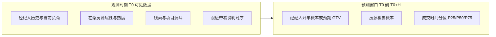
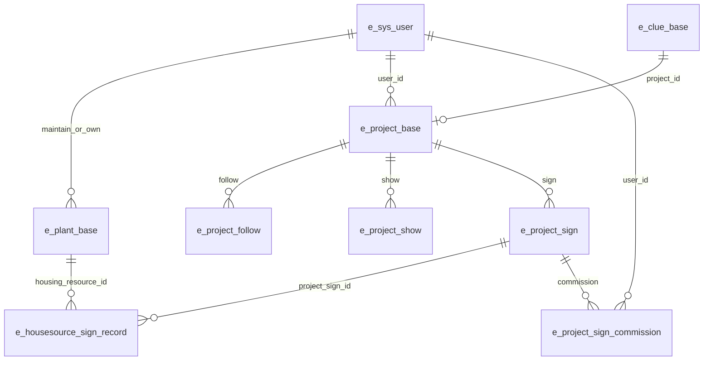

# GTV 成交推演试点 — 方案设计

> 版本：v0.1（2026-07）· 状态：设计讨论稿  
> 数据根目录：`/Users/ssyb/Downloads/data`（立业云 / GTV 业务库 SQL 导出）  
> 母文档：[design.md](./design.md)（决策中心总架构）· 并行线：[policy-org-simulation.md](./policy-org-simulation.md) · **本试点工程优先落地**

---

## 1. 定位与核心命题

### 1.1 一句话定义

基于公司现有 GTV（产业地产 CRM）真实库，在**历史可回测**的前提下，推演未来窗口内：

1. **哪个经纪人会开单**（归因到业务用户 / 佣金分配人）
2. **哪个房源会租/售出去**（厂房 / 仓库 / 办公）
3. **什么时候成交**（距观测点的天数或日历周）

### 1.2 与决策中心总架构的关系

本试点对应 [design.md](./design.md) 中的**商业决策场景模板**，不是社媒舆论 P1 的改名：

| design.md 概念 | GTV 映射 |
|----------------|----------|
| Ontology / 真实资料底座 | 房源 · 线索 · 项目 · 跟进 · 签约（结构化库，不走 LLM 抽实体） |
| World Slice | 城市 × 时间窗 × 在架房源 + 活跃项目/线索快照 |
| Intervention（后置） | 调价、换维护人、线索重分配、加推带看 |
| Scenario × Run | 多运营策略对比；MVP 先做单点预测榜 + 回测 |
| 推演引擎 | **统计排序 / 生存分析为主**；LLM Agent 仅作解释层，**不**用 OASIS 发帖模拟成交 |

### 1.3 双线并行原则

| 线 | 目标 | 节奏 |
|----|------|------|
| **A · GTV 成交推演（本文件）** | 谁开单 / 哪套房 / 何时 | **当前优先** |
| **B · 政策机构线** | Org Dossier → 函件刺激 → 机构反应 | 设计见 [policy-org-simulation.md](./policy-org-simulation.md)；工程排在 GTV MVP 可演示之后或穿插 |

两条线共享同一产品原则：**先真实资料，再推演反应**；不共享同一模拟内核。

---

## 2. 要回答的三个问题（产品输出）

MVP 交付形态（先离线报告，不强制接前端五步）：

- **经纪人榜**：Top-K 开单概率 / 预期签约数 / 预期佣金（若金额字段可用）
- **房源榜**：分类型（厂房/仓/办）Top-K 租、售概率
- **时间**：每条预测附「预计成交天数」或「落在第几周」
- **回测页**：用历史切分报告 AUC / Top-K 命中 / 时间误差，证明不是故事

---

## 3. 数据底座

### 3.1 库优先级

| 优先级 | 库 | 角色 |
|--------|-----|------|
| P0 | `lyy_manage` | 主业务：房源、线索、项目、签约、用户 |
| P1 | `lyyh-admin` / `lysj_admin` / `lymh-admin` | 分站镜像；经纪人字段偶有补充 |
| P2 | `lyy_screen` / `lyy-applet` / `douyin_leads` | 大屏指标、C 端行为、抖音线索（增强特征，非 MVP 必需） |

### 3.2 核心实体与表

| 实体 | 主表 | 关键字段 |
|------|------|----------|
| 经纪人 | `e_sys_user` | `user_id`, `nick_name`, `engage_time`, 部门关联表；**勿依赖空瘦的 `t_broker_info`** |
| 厂房 | `e_plant_base` | `maintain_person_id`, `user_id`, 城市/面积/租售类型, `follow_num`, `show_num`, `up_time`, `status` |
| 仓库 / 办公 | `e_warehouse_base` / `e_office_base`+`e_office_room` | 同构字段 |
| 线索 | `e_clue_base` | 意向城市、租购、`plan_time`, `deal_type`, `project_manager` |
| 项目 | `e_project_base` | `project_stage`, `user_id`, 价格区间, `follow_time` |
| 签约（强标签） | `e_project_sign` | `contract_time`, `status`, `housing_resource_id`, 金额 |
| 签约房源明细 | `e_housesource_sign_record` | `sign_type`, `type`(1厂/2办/3仓), `create_time`, `status` |
| 开单归因 | `e_project_sign_commission` | `project_sign_id` → `user_id` + `user_type` |
| 行为 | `e_project_follow` / `e_project_show` / `e_*_follow` | 时序密度特征 |

体量粗估（导出文件）：厂房 ~100MB、仓库 ~66MB、办公 ~84MB、园区 ~317MB、线索 ~20MB、项目 ~23MB、项目跟进 ~19MB、签约 ~2.5MB、签约房源 ~0.5MB、用户 ~0.6MB。

### 3.3 标签定义（已定 · MVP）

| 问题 | 正样本定义 | 负样本 / 删失 |
|------|------------|----------------|
| 房源租售出去 | `e_housesource_sign_record` 且 `status=1`（已通过），或关联 `e_project_sign.status=1` | 观测窗口结束仍未签约；下架且未签约单独标记 |
| 租 vs 售 | `sign_type`：1/3→租，2/4→售 | — |
| 经纪人开单 | 窗口内出现 `e_project_sign_commission.user_id` 指向该用户的已通过签约；若佣金表稀疏则回退：`project.user_id` / 房源 `maintain_person_id` 与签约关联 | 窗口内无归因签约 |
| 何时 | `T_sign - T0`（天）；优先 `e_project_sign.contract_time`，否则 `create_time` | 未成交 → 生存分析右删失 |

软标签（仅作漏斗分析 / 辅助特征，**不作为领导三问的主验收**）：线索 `deal_type=7`（已选址）、项目阶段推进。

### 3.4 隐私与使用边界（已定）

- 分析默认**本机离线**；手机号、身份证、客户姓名等 PII **不进云端 LLM**。
- 进入任何 LLM 解释层前：脱敏（哈希 ID、去掉联系方式、公司名可保留行业级粗粒度）。
- 原始 dump 不入库 Git；派生的脱敏特征表可放本地工作区（gitignore）。

---

## 4. 方法设计

### 4.1 为什么不用 OASIS 发帖

成交是 CRM 漏斗事件，不是社交传播。用发帖模拟「谁开单」既不可回测，也浪费已有结构化标签。GTV 试点内核 = **可回测预测模型**。

### 4.2 三层能力

| 层 | 内容 | 阶段 |
|----|------|------|
| L1 特征与标签管道 | SQL dump → 解析/导入 → 实体宽表 → 时间对齐的样本表 | G0 |
| L2 预测模型 | 经纪人排序、房源租售分类、成交时间（生存/分位数回归） | G1 |
| L3 解释与干预（可选） | Dossier 卡片 + LLM 叙事；多策略 what-if | G2，接决策中心壳 |

### 4.3 模型选型（已定 · MVP）

- **房源是否成交 / 租或售**：梯度提升（LightGBM/XGBoost）或强基线逻辑回归；按城市分层或加城市特征。
- **经纪人是否开单 / 开单数**：同样排序或计数模型；特征含历史转化、在管房源质量、跟进负荷、活跃项目阶段分布。
- **何时**：Kaplan–Meier / Cox 或梯度提升生存（或直接回归 `log(days)` + 删失处理）；输出 P50 天数即可演示。
- **禁止泄漏**：特征只用 `T0` 及之前的信息（跟进次数截断到 T0、历史业绩用 T0 前窗口）。

### 4.4 回测协议（已定）

1. 选预测地平线 `H`（默认 30 / 60 / 90 天，MVP 先固定 **60 天**）。
2. 时间滚动：多个 `T0`（如每月初），train = `[T0-6~12m, T0)`，eval = `[T0, T0+H]`。（dump 核实签约房源记录约 2025-08 → 2026-07，历史约 1 年，train 窗以实际覆盖为准）
3. 主指标：
   - 房源：ROC-AUC、PR-AUC、Top-50 命中率
   - 经纪人：Top-K 开单命中、Spearman（预测分 vs 真实开单数）
   - 时间：成交样本的 MAE（天）；报告删失比例
4. 基线：热度（带看/跟进）排序、历史转化率、随机 —— 模型必须显著优于基线才演示给领导。

---

## 5. 切片范围（已定 · MVP）

| 维度 | MVP 默认 | 说明 |
|------|----------|------|
| 房源类型 | **三类都做特征工程**，演示榜**先突出厂房**（体量最大） | 仓/办同管线输出 |
| 城市 | dump 内全量城市，报告按城市 Top 拆分 | 若单城样本过稀则合并「头部城市 + 其他」 |
| 时间 | 以签约时间能覆盖的最近有效区间做滚动回测 | EDA 后锁定具体起止月 |
| 经纪人 | `e_sys_user` 中在样本期内有房源维护/项目负责/佣金记录者 | 过滤停用/删除账号 |

---

## 6. 与决策中心产品的衔接（后置）

G2 再考虑接五步流程，避免阻塞试点：

| 步骤 | GTV 含义 |
|------|----------|
| Step1 资料 | 导入/同步 GTV 切片（脱敏） |
| Step2 方案 | 干预：调价幅度、维护人更换、线索分配规则 |
| Step3–4 推演对比 | 多策略下预期 GTV / 成交套数对比（统计引擎，非 OASIS） |
| Step5 报告 | 经纪人动作建议 + 房源推介清单 + 风险（长期未跟进） |

政策机构线复用「Dossier → 刺激 → 反应」叙事框架，但不复用本试点的成交标签管道。

---

## 7. 演进路线

| 阶段 | 目标 | 关键交付 |
|------|------|----------|
| **G0 · 数据摸清** | 能画 ER、定标签、无泄漏切分 | 数据字典、样本量、标签分布、可行性结论 |
| **G1 · 可回测 MVP** | 答领导三问 + 回测优于基线 | 三张榜 + 回测报告（Notebook/本地脚本即可） |
| **G2 · 产品化** | 进决策中心或独立看板 | Dossier、干预对比、脱敏同步管道 |
| **G3 · 增强** | 抖音线索 / 小程序行为 / 实时增量 | 在线特征、校准账本 |

政策机构线（L0 Org Dossier 等）独立排期，不阻塞 G0–G1。

---

## 8. 工程约定

- **工作代码位置（建议）**：`ai-decision-center/backend/scripts/gtv_forecast/` 或独立分析目录；原始 SQL 仍留在 `Downloads/data`。
- **导入方式**：优先解析需要的表到本地 SQLite/DuckDB/Parquet（全量 MySQL 恢复可选，非必须）。
- **不提交**：原始 dump、含 PII 的中间表、`.env` 密钥。
- **依赖**：pandas + python SQL 解析或 DuckDB；模型用 lightgbm/sklearn；可视化用现有习惯即可。

---

## 9. 已定与待 EDA 确认

### 已定

1. 双线都做；**工程优先 GTV G0→G1**。
2. 主标签 = 已通过签约（`e_project_sign` / `e_housesource_sign_record`）；开单归因优先佣金表。
3. 内核 = 统计预测 + 回测；不用 OASIS 演成交。
4. 隐私 = 本机、PII 不进云端 LLM。
5. MVP 交付 = 离线三榜 + 回测，不强制改前端。

### 待 G0 EDA 确认（不阻塞开工）

1. `e_project_sign` 与 `e_housesource_sign_record` 覆盖率、时间跨度、审批通过占比。
2. 佣金表对「开单人」的覆盖是否足够；回退规则命中率。
3. 各城市正样本是否够做分层模型。
4. `Data1.tar` 是否含增量/更全库（仅当主库标签不足时再解压评估）。

---

## 10. 对外一句话

> 用立业云 GTV 真实库做可回测的成交推演：预测谁开单、哪套厂房/仓/办会租售、何时成交；统计模型先落地，再视需要接到决策中心多方案壳。政策机构线并行规划、错峰实施。
