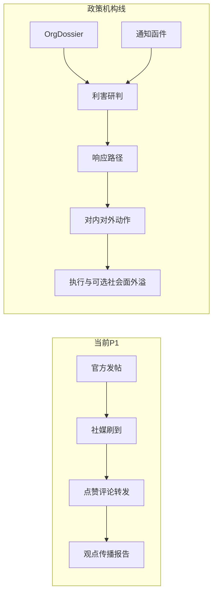
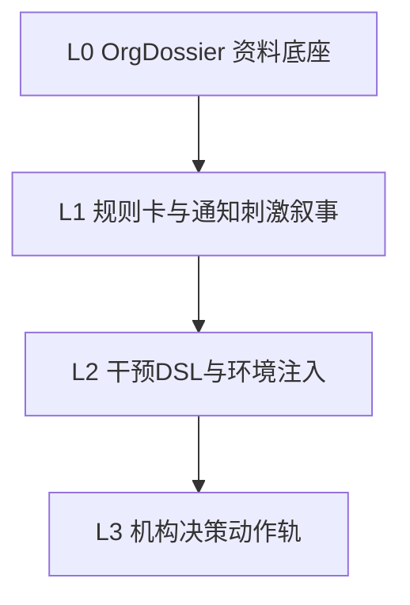

# 政策机构线 — 方案设计

> 版本：v0.1（2026-07）· 状态：设计讨论稿  
> 母文档：[design.md](./design.md) · 并行试点：[gtv-deal-forecast.md](./gtv-deal-forecast.md)（工程优先）  
> 背景：领导反馈「推演偏社媒发帖、缺机构决策上下文」；共识是先真实机构资料，再推演对通知/公告的反应

---

## 1. 定位与核心命题

### 1.1 一句话定义

对政策落地场景：先为重点机构/企业建立**真实资料档案（Org Dossier）**，再注入**通知 / 公告 / 函件**等刺激，推演各主体的内部研判、响应路径与对内/对外动作，并与「不出台 / 不同条文」等方案做对比——而不是把机构当成社媒账号去刷帖发评论。

### 1.2 核心公式

```text
机构反应 = f(OrgDossier, Notice, 场景规则)
≠ f(社媒人设, 刷到的帖子)
```

### 1.3 领导反馈 → 产品缺口

| 领导点 | 现状（P1） | 本线目标 |
|--------|------------|----------|
| 偏社交发帖、行为浅 | OASIS 几乎只有发帖/赞/转/评；干预≈`initial_posts` | 通知、研判、协调等路径（分阶段落地） |
| 缺政府/机构真实上下文 | 机构=官方社媒账号；政策=种子帖 | 政策经函件/内部流转的上下文 |
| 机构按业务判断吸引力 | 有 stance，无业务/合规/成本结构 | Org Dossier 驱动利害判断 |
| 沟通平台与响应模式 | Cast Sheet 无渠道偏好 | `channel_profile` / `response_mode` |
| 正式通知/研判/协调 | 设计有挂钩，代码无 | L2–L3 动作与日志 |

### 1.4 与舆情 P1、GTV 线的关系

| | 舆情 P1（已有） | 政策机构线（本文件） | GTV 成交（并行） |
|--|----------------|---------------------|------------------|
| 主体 | 网民 + 账号 | 政府/企业/协会等机构 | 经纪人、房源、客户 |
| 资料 | 文档→图谱 | **Org Dossier（定向深档案）** | CRM 结构化库 |
| 刺激 | 社媒种子帖 | **通知/函件/征求意见** | 调价、分客（后置） |
| 反应 | 发帖互动 | 研判 → 路径 → 对内对外动作 | 开单/租售/时间 |
| 引擎 | OASIS 社媒 | 档案注入 + 干预 DSL → 机构决策轨 | 统计预测 |
| 节奏 | 已跑通闭环 | **设计已定，工程错峰于 GTV G0–G1 之后** | **当前优先** |

原则共享：**先真实资料，再推演反应**。内核不共享。



---

## 2. 概念模型

| 概念 | 定义 |
|------|------|
| **Org Dossier** | 单个重点机构的结构化档案卡：身份、业务、约束、历史姿态、沟通习惯、事实出处 |
| **Notice（刺激）** | 通知 / 公告 / 函件 / 征求意见稿；可分阶段（征求意见 → 印发 → 生效） |
| **Channel Profile** | 该主体偏好的沟通通道：公函 / 会议 / 官网通知 / 社媒 / 沉默 |
| **Response Mode** | 公开表态 / 内部研判后表态 / 观望 / 游说 / 执行配合或抵制 |
| **Org Decision Track** | 与社媒轨并行的动作族（L3）：发通知、内部研判、跨部门协调、机构立场等 |
| **Social Spillover** | 机构决策后是否外溢到社媒轨（可选，避免「只会发帖」成为主叙事） |

决策任务形态仍服从 [design.md](./design.md)：`Decision = {多 Scenario} → 对比 → 人拍板`；本线 Scenario 的自变量是**政策条文/阶段/触达对象**，因变量是**机构立场、执行阻力、协同时滞、企业顺风指数**等。

---

## 3. Org Dossier（L0 · 资料底座）

没有 L0，后续规则卡与动作轨都容易变成更精致的编造。

### 3.1 档案卡最小字段（已定方向）

- **身份**：名称、类型（政府 / 国企 / 民企 / 协会…）、管辖或经营地域  
- **业务**：主营、对政策敏感的业务线  
- **约束**：合规压力、成本结构、依赖（上游 / 牌照 / 补贴）  
- **历史姿态**：对同类政策的公开表态或行动  
- **沟通习惯**：公函 / 会议 / 社媒 / 沉默（可后补）  
- **来源**：关键事实带出处（文件名 / URL），禁止空口人设  

### 3.2 资料来源（已定 · MVP）

1. **用户上传机构资料包**（PDF / 年报 / 新闻剪报）— 主路径  
2. **从已有本体/上传文档定向抽取**该实体片段 — 复用现有管道  
3. **联网补全** — 后置（合规与稳定性另评）  

### 3.3 深度 vs 广度（已定 · MVP）

单次决策先做 **3–5 个重点机构深档案**；图谱内其余机构可保留浅实体，不强制深档案。

### 3.4 注入点

- 人设 / Cast：生成时强制注入 Dossier 摘要，而非仅实体名 + 通用 org prompt  
- 报告：机构反应须能追溯到档案条目（「依据哪条资料」）  
- 采访：问动机时优先检索 Dossier，再谈模拟中的发帖记忆  

---

## 4. 能力分层（L0 → L3）



| 层 | 内容 | 工程量 | 领导感知 |
|----|------|--------|----------|
| **L0** | 重点机构档案；人设/报告强制引用 | 中（产品+抽取） | 「这家企业是有材料的」 |
| **L1** | `channel_profile` / `response_mode` / 业务利害；刺激=收到通知；报告「机构响应」章 | 中低，可少改 OASIS | 「像在做政策研判」 |
| **L2** | Intervention = `{content, actor, channel, phase, intensity, env_patch, target_orgs}`；多阶段 `scheduled_events` | 中，对齐 design §4.4 | 「政策不是一条帖」 |
| **L3** | `ISSUE_NOTICE` / `INTERNAL_DELIBERATION` / `CROSS_DEPT_COORD` / `ORG_POSITION`；与社媒轨并行 | 高，近新引擎 | 时间线出现非发帖动作 |

**分期（已定方向）**

| 阶段 | 交付 |
|------|------|
| **P1.5** | L0 + L1：档案 + 通知刺激 + 反应叙事 + 报告机构章 |
| **P2 前半** | L2：干预 DSL / 环境注入 / 多阶段事件 |
| **P2/P3** | L3：机构决策轨 + 政策模板指标 |

不建议：未做 L0/L1 就直接开 L3；也不建议用「多加几个社媒平台」应付本次反馈。

---

## 5. 刺激与干预

### 5.1 从「种子帖」到「通知」

| | P1 默认 | 政策线 |
|--|---------|--------|
| 形态 | `initial_posts` | Notice 文本 + 阶段标签 |
| 触达 | 刷到 feed | 指定 `target_orgs` 或按管辖/行业匹配 |
| 上下文 | 帖子内容 | `env_patch`：「征求意见中 / 已印发 / 已生效」 |

L1 可先把 Notice **落成事件文本 + prompt/env 注入**（动作日志仍可能偏「说出来」）；L3 再变成独立动作类型。

### 5.2 多阶段政策剧本（示例）

1. 征求意见稿下发 → 内部研判窗口  
2. 正式印发 → 跨部门协调 / 企业合规评估  
3. 生效执行 → 执行阻力与社会面外溢（可选进社媒轨）  

同一 World Slice 上对比：基线（不出台）vs 方案 A/B（不同强度或不同过渡期）。

---

## 6. 输出与指标

相对舆情模板的触达/转发，本线优先：

- **机构立场分布**（支持 / 有条件配合 / 观望 / 反对）及随阶段演化  
- **执行阻力**（成本、合规、产能/运力等，来自 Dossier）  
- **协同时滞**（跨部门路径长度；L3 可量化，L1 叙事估计）  
- **企业顺风指数**（业务与政策方向的契合度）  
- **可追溯依据**（反应 ↔ Dossier 条目）  
- （可选）社会面外溢：仅当 Scenario 需要时启用社媒轨指标  

报告大纲建议增加独立章：**机构响应与执行风险**（先于或并列于「舆论热度」）。

---

## 7. 与现有工程的挂钩

| 模块 | 挂钩方式 |
|------|----------|
| 文档管道 / 图谱 | 定向抽取充实 Org Dossier；不全量重建 |
| Cast Sheet / persona | 增加渠道与响应模式字段；注入 Dossier |
| Intervention / event_config | 从帖列表扩展为 Notice + phase + env_patch（L2） |
| OASIS | L1–L2 尽量 adapter/包一层；L3 新动作族需扩展或旁路日志 |
| ReportAgent / Interview | 机构章与「依据档案」引用；采访走 Dossier |
| Platform Plugin | 公函/通知不等于抖音插件；勿用多平台皮肤替代本线 |

详见 [design.md](./design.md) §4.4、§7；社媒渠道扩展见 [platform-plugins.md](./platform-plugins.md)（正交，不替代本线）。

---

## 8. 试点 case（建议默认）

- **素材路径**：在现有限行类 case 上**圈定 3–5 个真实机构**（交管相关部门、行业协会、平台企业、沿街经营主体代表等），补齐资料包，把刺激改写成「通知/征求意见」形态。  
- **备选**：另选更「函件 / 跨部门协调」特征明显的政策 case（素材成本更高，叙事更贴领导原话）。  
- **验收（P1.5）**：领导可见「某机构有档案 + 收到公告后的研判与可能反应」，且反应能指回资料；**不强制**时间线已有非发帖动作（那是 L3）。

社媒轨在政策演示中：**弱化为主叙事，可保留为外溢层**，避免「又在发帖」的观感。

---

## 9. 演进与排期

| 阶段 | 目标 | 说明 |
|------|------|------|
| **设计 v0.1（当前）** | 本文档对齐 | 与 GTV 双线并存 |
| **工程启动** | P1.5 = L0+L1 | **排在 GTV G0–G1 可演示之后**，或人力允许时穿插做 Dossier 字段原型 |
| **P2** | L2 干预 DSL | 对齐 design 干预升级 |
| **P2/P3** | L3 决策轨 | 单独立项，勿与 GTV 抢同一迭代 |

---

## 10. 已定与待定

### 已定

1. 公式：`机构反应 = f(OrgDossier, Notice, 规则)`。  
2. 必须先有 L0；P1.5 = L0 + L1。  
3. 资料：上传包 + 本体定向抽取；联网后置。  
4. 深度：单次 3–5 个重点机构深档案。  
5. 与 GTV **双线都做**；**工程优先 GTV**，本线设计先行、实施错峰。  
6. 不用「多平台皮肤」替代机构决策深度。

### 待工程启动前确认

1. 第一个正式试点是「限行 + 机构包」还是换函件型 case。  
2. P1.5 是否必须改前端五步 UI，还是先报告章 + Cast 字段即可。  
3. L3 立项时间是否与 design P3 政策模板合并。

---

## 11. 对外一句话

> P1 已跑通社媒舆论对比；政策机构线的核心不是多发帖，而是 **「真实机构资料 → 收到通知/公告 → 推演机构反应」**。先做 Org Dossier 与通知刺激（P1.5），再演进干预 DSL 与独立决策动作轨；与 GTV 成交试点并行规划、错峰实施。
